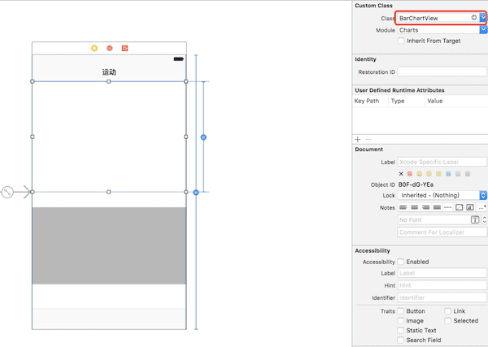
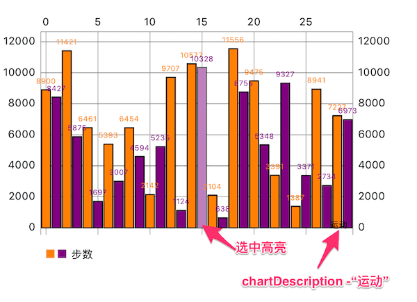
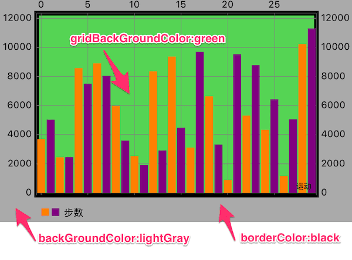
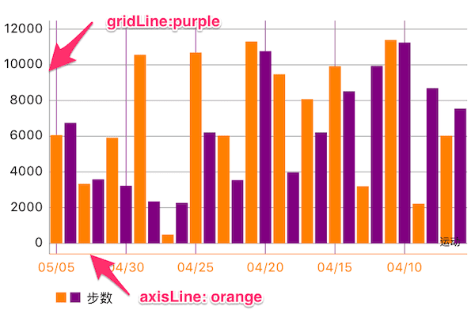
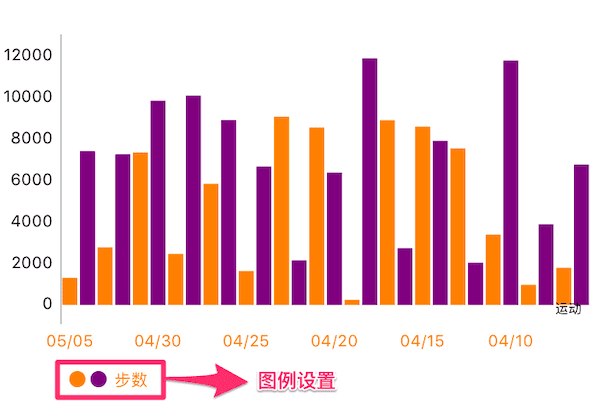
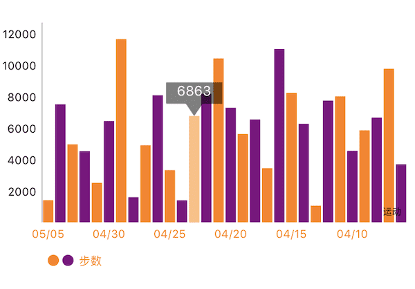
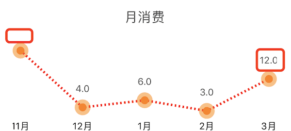
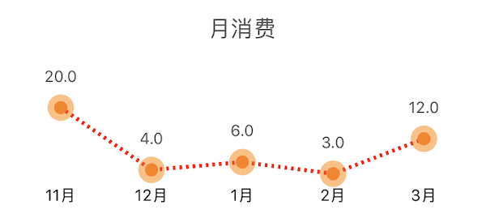

介绍 Swift 一个优秀的图表库的使用

<!--more-->

### 版本

* Charts  3.0.4
* Swift 3.0


### 柱形图

#### 1.创建 图表

创建有两种方式：
* StoryBoard 创建
* 代码创建

##### StoryBoard 创建





将其连接到 ViewController
```swift
@IBOutlet weak var barChart: BarChartView!
```
##### 代码创建
```swift
let barChart = BarChartView.init(frame: CGRect.init(x: 0, y: 0, width: screenWidth, height: 300))
```


#### 2.自定义柱形

```swift
//右下角描述，默认 “Description Label”
barChart.chartDescription?.text = "运动"        
barChart.backgroundColor = UIColor.white

let steps = dataSource.chartSteps //自定义的用于Y轴显示的数据

var dataEntries: [BarChartDataEntry] = []
for i in 0 ..< dates.count {
    //每一个dataEntry表示一个柱形数据，如 (0,1000) 表示第一个柱形的值为1000
    let dataEntry = BarChartDataEntry.init(x: Double(i), y: Double(steps[i]))
    dataEntries.append(dataEntry)
}

let barChartDataSet = BarChartDataSet(values: dataEntries, label: "步数")

//显示的数值的颜色，可以多个颜色
barChartDataSet.valueColors = [UIColor.orange, UIColor.purple]  
//是否显示数值 
barChartDataSet.drawValuesEnabled = true  
// 边界线设置                     
barChartDataSet.barBorderWidth = 1                                 
barChartDataSet.barBorderColor = UIColor.black 
// 柱形颜色                 
barChartDataSet.colors = [UIColor.orange, UIColor.purple]
// 选中的高亮设置
barChartDataSet.highlightColor = UIColor.white
barChartDataSet.highlightAlpha = 0.5

let barChartData = BarChartData(dataSet: barChartDataSet)

//柱形数据
barChart.data = barChartData

```
##### 效果：




#### 2.整个图表基本设置

```swift
barChart.drawGridBackgroundEnabled = true
barChart.drawBordersEnabled = true
barChart.gridBackgroundColor = UIColor.green.withAlphaComponent(0.5)
barChart.borderColor = UIColor.blackbarChart.borderLineWidth = 5
barChart.backgroundColor = UIColor.lightGray
```
##### 效果：




#### 3.自定义坐标轴

```swift
// X轴
barChart.xAxis.valueFormatter = IndexAxisValueFormatter.init(values: dates)
barChart.xAxis.granularity = 1.0  //最小粒度，数据量增加后会自动增加粒度
barChart.xAxis.labelPosition = .bottom
barChart.xAxis.drawGridLinesEnabled = true
 //是否绘制网格，竖线
barChart.xAxis.gridColor = UIColor.purple //网格颜色
barChart.xAxis.drawAxisLineEnabled = true  //是否绘制 X 轴 线
barChart.xAxis.axisLineColor = UIColor.orange //X轴线颜色
barChart.xAxis.labelTextColor = UIColor.orange //X轴字体颜色

// 右侧Y轴，属性和 X 轴设置一样
barChart.rightAxis.enabled = false
// 左侧Y轴
barChart.leftAxis.drawGridLinesEnabled = true
```
##### 效果：




#### 4.自定义图例

```swift
//左下角图例
barChart.legend.enabled = true
barChart.legend.textColor = UIColor.orange
barChart.legend.formSize = 10
barChart.legend.form = .circle
barChart.legend.yOffset = 5
barChart.legend.xOffset = 5

```



#### 5.自定义选中标记

```swift
//color:标记背景颜色， insets:text相对整个markerView的insets
let markerView = BalloonMarker.init(color: UIColor.black.withAlphaComponent(0.5), 
    font: UIFont.systemFont(ofSize: 12), textColor: UIColor.white, insets: UIEdgeInsets.zero)
//最小的size
markerView.minimumSize = CGSize.init(width: 50, height: 30)
markerView.chartView = barChart
barChart.marker = markerView
```

这个 markerView 需要自己定义，Charts库只给了一个基类（基类没有实现数据该如何表示）和协议。
上面用到的类 BalloonMarker 是 ChartsDemo 中已经实现的类，加到工程中可以直接拿过来用。
[BalloonMarker.swift](https://github.com/liuxuan30/Charts/blob/master/ChartsDemo/Classes/Components/BalloonMarker.swift)

```swift
//数据的自定义在这个方法中实现
open override func refreshContent(entry: ChartDataEntry, highlight: Highlight{   
    setLabel(String(Int(entry.y)))
}
//在这个方法中绘制
func draw(context: CGContext, point: CGPoint)
```
##### 效果：




#### 6.Delegate 

```swift
//设置代理
barChart.delegate = self
//代理实现的方法
public protocol ChartViewDelegate
{
    /// Called when a value has been selected inside the chart.
    /// - parameter entry: The selected Entry.
    /// - parameter highlight: The corresponding highlight object that contains information about the highlighted position such as dataSetIndex etc.
    @objc optional func chartValueSelected(_ chartView: ChartViewBase, entry: ChartDataEntry, highlight: Highlight)
    
    // Called when nothing has been selected or an "un-select" has been made.
    @objc optional func chartValueNothingSelected(_ chartView: ChartViewBase)
    
    // Callbacks when the chart is scaled / zoomed via pinch zoom gesture.
    @objc optional func chartScaled(_ chartView: ChartViewBase, scaleX: CGFloat, scaleY: CGFloat)
    
    // Callbacks when the chart is moved / translated via drag gesture.
    @objc optional func chartTranslated(_ chartView: ChartViewBase, dX: CGFloat, dY: CGFloat)
}
```


### 折线图


图表的基本设置和柱形图一样，但是可以自定义折线。

#### 自定义折线

```swift
let lineChartDataSet = LineChartDataSet(values: dataEntries, label: nil)

//设置折线线条
lineChartDataSet.lineWidth = 3

//外圆
lineChartDataSet.drawCirclesEnabled = true
lineChartDataSet.circleColors = [UIColor.orange.withAlphaComponent(0.5)]
lineChartDataSet.circleRadius = 10
//内圆
lineChartDataSet.drawCircleHoleEnabled = true
lineChartDataSet.circleHoleColor = UIColor.orange
lineChartDataSet.circleHoleRadius = 5

//线条显示样式
lineChartDataSet.lineDashLengths = [2,3] //虚线样式，[2, 3]对应虚线[--   --   ]
 ,[1, 3, 4, 2] 对应 [-   ----  -   ——  ]
lineChartDataSet.lineDashPhase = 0.5
lineChartDataSet.colors = [UIColor.red]

//线条上的文字
lineChartDataSet.drawValuesEnabled = true
lineChartDataSet.valueColors = [UIColor.darkGray]
lineChartDataSet.valueFont = UIFont.systemFont(ofSize: 12)
```
##### 效果：




**注意：**上方折线图被框起来的部分，数据显示是不完整，因为数据超出整个 LineChartView，就不显示了
这个时候通过设置下面属性使数据可以完全显示
```swift
 // 设置最小的padding（图表对于整个 Chart），默认为10，不设置大一点可能会造成数据在 Chart 外无法显示
 lineChart.minOffset = 30
```
#### 设置后效果：

