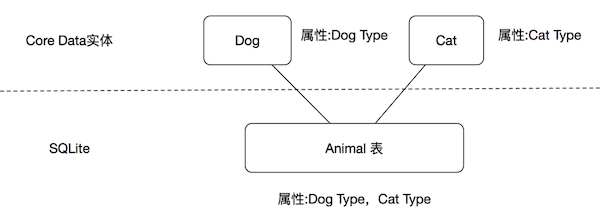

很早以前对 CoreData 知识的一些整理，今天才发出来

<!--more-->

### 1. CoreData 架构

一个基本的 CoreData 栈由四个部分组成： 
* 托管对象 （ NSManagedObject）
* 托管对象上下文 （ NSManagedObjectContext）
* 持久化存储协调器  （NSPersistentStoreCoordinator）
* 持久化存储 （ NSPersistentStore）

托管对象存在于一个特定的上下文（托管对象上下文）里，托管对象上下文记录了它管理的对象，以及你对这些对象的所有操作，比如插入、删除和修改等。 

上下文和持久化存储协调器相连，位于持久化存储和托管对象上下文之间，是位于Core Data栈正中间的一个黑盒对象，通常不会直接打交道。 

持久化存储是持久化存储协调器的一部分（一个 NSPersistentStore  实例与一个特定的协调器相绑定），负责在底层数据存储或读取数据。大多数使用SQLite作为持久化存储。 

### 2. CoreData 关系

#### 2.1 子实体

创建子实体的唯一原因是，你需要在单一的获取请求的结果或者实体的关系里得到不同的类型的对象。如在一个 table view 里将 实体 Dog 和 Cat 一起展示 或者只展示他们其中一种数据。可以添加一个抽象实体 Animal ，并将 Dog 和 Cat作为它的子实体来实现。将 Dog 和 Cat 共享的属性移入 Animal。 

建好子实体后，可以使用获取 Animal 的请求，同时返回符合请求的 Dog 和 Cat对象。 

但是 Dog 和 Cat 的实体类并没有继承 Animal 实体类。

 

#### 2.2 理解并避免使用子实体

共同父实体的子实体共享一个公共的数据库表，所有兄弟实体的的所有属性都会被合并进这张表里。 

这使得 Core Data 不得不从一个巨大的数据库表里读取所有数据，可能存在性能和内存的问题。所以使用子实体前先考虑：要是把拥有共同父实体的所有实体合并在一张表会不会很糟糕。

 

#### 2.3 创建关系

当两个实体创建好关系后，Core Data会自动更新反向关系。如设置 Teacher 的 student 时，在 Student 上对应的 students 会被自动更新。需要注意的是，反向关系的更新不会立刻发生，而是在上下文的 processPendingChanges( ) 方法被调用时更新。不需要手动调用这个方法， Core Data 会在适当的时候处理好这些事情。 

“对多”关系有两种形式：有序和无序。默认情况下是无序，是 Set 类型。这可以保证对象唯一性，但是没有特定顺序。当在模型编辑器选择一个“对多”关系时，勾选 ordered 复选框可以改变为有序。有序的关系是 NSOrderedSet 类型，这可以保证对象唯一性以及特定顺序。 

#### 2.4 关系和删除：

当你删除对象时，你在Xcode内置的模型编辑器中为实体的关系设定的删除规则（Delete Rules）

* nullify（作废）：当A对象的关系指向的B对象被删除后，A对象的关系将被设为nil。对于To Many关系类型，B对象只会从A对象的关系的容器中被移除。
* cascade（级联）：当B对象的关系指向的C对象被删除后，B对象也会被删除。B对象关联（以Cascade删除规则）的二级对象A也会被删除。以此类推。
* deny（拒绝）：如果删除A对象时，A对象的关系指向的B对象仍存在，则删除操作会被拒绝。
* no action：当A对象的关系指向的B对象被删除后，A对象保持不变，这意味着A对象的关系会指向一个不存在的对象。如果没有充分的理由，最好不要使用。

### 3. CoreData 数据类型

#### 3.1 数值类型

对于所存储数字的类型取决于需要存储的数值范围。如只需存储 -32768 ~ 32767 的数字，使用16位整数就够了。对于浮点数，建议始终使用双精度。十进制数字主要用于处理货币值。 

当在 OC 里实现托管对象类是，可以用 NSNumber 来表示多有数值属性。 

十进制数在 OC 和 swift 里都是用 NSDecimalNumber 来表示。如果正好需要存储货币值，那么应该看看这个选项。NSDecimalNumber 可以精确地指定数字该如何取整，如何处理精确性，上溢，下溢。 

#### 3.2 日期

NSDate 只是一个与基准时间的间隔距离的双精度值得封装，它是自时间2001年1月1日午夜以来的秒数。所以 Core Data 在存储日期的时候，也只是在数据库存储一个双精度值。 

#### 3.3  二进制数据

二进制数据，即 NSData。 

对于二进制数据，Core Data 支持所谓的外部存储，可以通过设置 NSAttributeDescription 实例的 allowsExternalBinaryDataStorage 属性，或者在 Data Model Inspector 里勾上 “Allows External Storage” 复选框来开启。它可以让 Core Data 根据数据的大小决定是把二进制数据存储在 SQLite 还是存储成外部文件。底层的 SQLite 可以直接在数据库里高效的存储不超过大概 100Kb 的二进制数据。一般来说这个选项通常应该开启。 

如果在你的模型对象里包含很大的二进制数据，那么将它们保持在内存里的开销会很昂贵。如果在大多数情况下，这个实体的二进制数据和其他属性需要一起呗获取，那么把它们存储在一起时合理的。否则，更好的做法应该是把二进制数据存储为一个单独的实体，并在两个实体间建立一个关系。 

另外一种方法是只在 Core Data 里存储文件名，然后根据文件名自己在磁盘上管理实际数据的存储。但是应该有充分的理由时才考虑这么做，因为确保 Core Data 和存储的文件之间的统一性并不容易。 

#### 3.4 自定义数据类型

遵循 NSCoding 协议的数据类型都可以直接声明为可转换的属性（Transformable）。不过也可以指定一个自定义转换器来用更高效的格式的存储数据。 

#### 3.5 默认值和可选值

在默认情况下，Core Data 托管的对象所有属性都是可选的。但是可以把属性设置成不可选的，然后在托管对象类里面为相应的属性使用非可选值得类型。在使用谓词的时候，确保不是 nil 尤其重要，因为 nil 在这种情况下具有特殊的意义。 

还可以在运行时设置默认值。可以覆盖 NSManageObject 的 awakeFromInsert( ) 方法，对属性赋默认值。 awakeFromInsert 方法在对象生命周期里只会被调用一次，就是对象第一次被创建的时候 