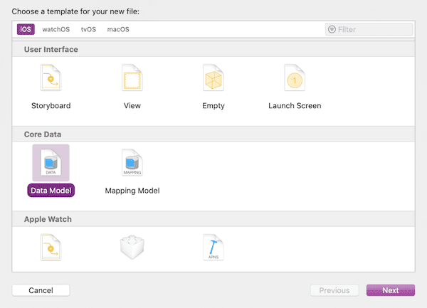
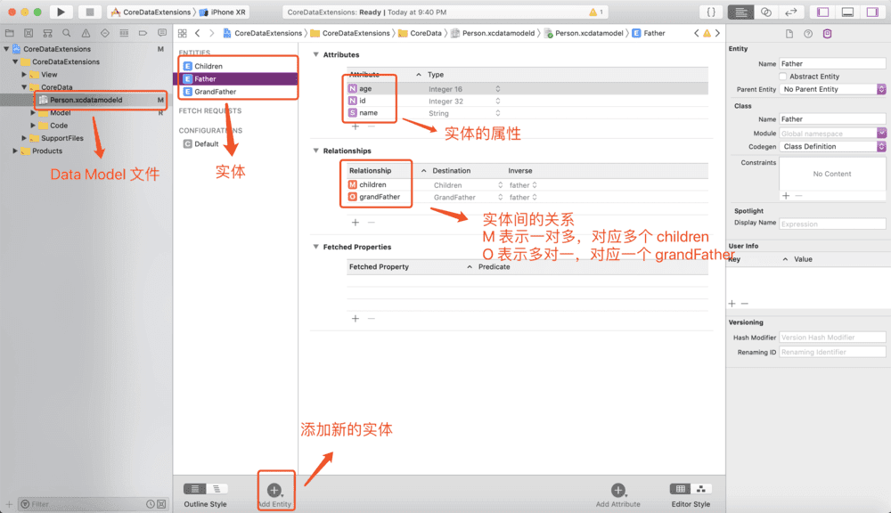
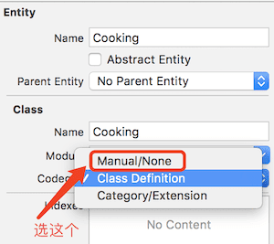
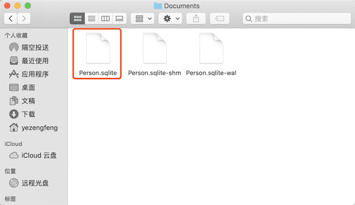

### 1. 创建一个 Data Model 文件

#### 1.1 创建文件

new file 中选择以下文件创建。顾名思义 Data Model 就是数据库需要操作的实体，通过文件的可视化操作创建一各个实体，这些实体会在 Core Data 数据库创建的时候生个一个个表（Table）



 

#### 1.2 Data Model 具体实现

创建完后我们添加实体、属性、关系，最后生成的一个 Data Model 文件如图



这样子我们对 Core Data 文件的操作已经完成了

这里有一点需要注意的，在旧版中的 XCode 中，没记错的话应该是 XCode 7，实体类都是需要自己创建的，但是在新版 XCode 中实体类会自动创建。要想自己创建实体类不使用默认的可以通过以下设置修改



### 2. CoreData 栈创建

我们知道，一个基本的 CoreData 栈由四个部分组成： 

- 托管对象 （ NSManagedObject）
- 托管对象上下文 （ NSManagedObjectContext）
- 持久化存储协调器  （NSPersistentStoreCoordinator）
- 持久化存储 （ NSPersistentStore）


一个简单的 CoreData 栈可以用如下代码创建，创建后则可以通过  ` NSManagedObjectContext` 获取`  NSManagedObject`

```swift
import CoreData

class CoreDataStack {
    
    static let sharedInstance = CoreDataStack()
 
    lazy var applicationDocumentsDirectory: NSURL = {
        let urls = FileManager.default.urls(for: .documentDirectory, in: .userDomainMask)
        return urls[urls.count-1] as NSURL
    }()
    
    /// 读取 Data Model （.xcdatamodeld）文件获取托管对象模型
    lazy var managedObjectModel: NSManagedObjectModel = {
        // momd 后缀会自动查找到相应的 Data Model 文件
        let modelURL = Bundle.main.url(forResource: "Person", withExtension: "momd")!
        return NSManagedObjectModel(contentsOf: modelURL)!
    }()
    
    /// 创建持久化存储协调器，在用对象模型初始化它以后，给它添加 NSSQLiteStoreType 的持久化存储。存储的位置由url指定
    lazy var persistentStoreCoordinator: NSPersistentStoreCoordinator = {
        var coordinator = NSPersistentStoreCoordinator.init(managedObjectModel: self.managedObjectModel)
        
        // CoreData 数据库 .sqlite 文件的路径
        let url = self.applicationDocumentsDirectory.appendingPathComponent("Person.sqlite")
        print("\(url!)")
        
        var error: NSError? = nil

        do{
            try coordinator.addPersistentStore(ofType: NSSQLiteStoreType, configurationName: nil, at: url, options: nil)
        }catch{
            let nserror = error as NSError
            fatalError("Unresolved error \(nserror), \(nserror.userInfo)")
        }
        
        return coordinator
    }()
    
    /// 使用 .mainQueueConcurrencyType 选项创建 主上下文，并赋给persistentStoreCoordinator
    lazy var managedObjectContext: NSManagedObjectContext = {
        let coordinator = self.persistentStoreCoordinator
        
        var managedObjectContext = NSManagedObjectContext.init(concurrencyType: .mainQueueConcurrencyType)
        managedObjectContext.persistentStoreCoordinator = coordinator
        return managedObjectContext
    }()
}
```

需要注意的是，往往一个 CoreData 栈不只有这些东西，比如既然有主上下文，在主线程上做数据操作，那么肯定也有子线程上下文，通过 `.privateQueueConcurrencyType` 创建。以及还有其他的支持等等。我们这里就用 主上下文 做实验了

这个时候只要执行获取上下文，就会在指定目录下创建好数据库

```swift
let _ = CoreDataStack.shared.mainManagedObjectContext
```

打开沙盒 Document 可以看到



### 3. CoreData 增删改查

对于 增删改查 操作都可以打开 上面的 `Person.sqlite` 查看结果

#### 3.1 增

```swift
// 获取上下文，获取的同时初始化了 CoreData 栈
let context = CoreDataStack.shared.mainManagedObjectContext
// 创建要插入的实体
let father = NSEntityDescription.insertNewObject(forEntityName: "Father", into: context) as! Father

// 给实体赋值，其中像 children，grandFather 这种关联的实体要赋值也需要传入一个对象
father.name = "Li gang"
father.children = []
//        father.grandFather = ...

// 保存上下文中所有有更改的数据
context.saveOrRollback()
```


#### 3.2 查

为什么不用 增删改查 的顺序而把查放在第二个呢，因为 删改 前需要先查

```swift
let context = CoreDataStack.shared.mainManagedObjectContext
// 通过实体名初始化一个 NSFetchRequest 用于设置查询条件
let request = NSFetchRequest<NSFetchRequestResult>(entityName: "Father")
// 设置查询条件
request.predicate = NSPredicate(format: "name = %@", "Li gang")
// 设置排序的方式，下面是根据 id 属性升序排序
request.sortDescriptors = [NSSortDescriptor(key: "id", ascending: true)]
// 获取结果
let entitys = try! context.fetch(request) as! [Father]
```


#### 3.3 删

```swift
let context = CoreDataStack.shared.mainManagedObjectContext
let request = NSFetchRequest<NSFetchRequestResult>(entityName: "Father")
request.predicate = NSPredicate(format: "name = %@", "Li gang")
let entitys = try! context.fetch(request) as! [Father]

// 遍历所有实体，删除
for entity in entitys {
	context.delete(entity)
}
// 保存上下文中所有有更改的数据
context.saveOrRollback()
```


#### 3.4 改

```swift
let context = CoreDataStack.shared.mainManagedObjectContext
let request = NSFetchRequest<NSFetchRequestResult>(entityName: "Father")
request.predicate = NSPredicate(format: "name = %@", "Li gang")
let entitys = try! context.fetch(request) as! [Father]

// 遍历所有实体，修改 name 属性
for entity in entitys {
    entity.name = "Li lei"
}
// 保存上下文中所有有更改的数据
context.saveOrRollback()
```