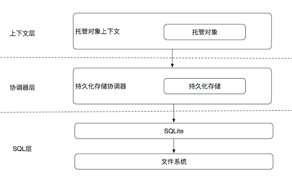

Core Data 作为一个持久化框架，那么性能一定是一个很重要的指标。如果只是几十上百条数据，并且实体间没有什么关系，那么这种性能提升其实并不关键，但是对于大量数据来说，对于提升性能就很重要了。我通过一些提高性能的操作对一个接近十万条数据，并且含有复杂关系的数据库做查询，可以将查找时间从 5、6秒缩短到 1 秒。

<!--more-->

### 1.Core Data 栈的性能特质

我们大致地把 Core Data 栈分成三层。顺着栈从上往下看，每往下看复杂度都呈指数级增加。 



假设我们需要访问托管对象的一个属性（比如 Person 对象的 name 属性）。如果这个托管对象已经被完全实体化，那么我们的操作会停留在上下文这一层。这将会消耗1个单位的时间或者能量。如果这个对象是一个惰值，但是数据存在于持久化存储的行缓存中，那么访问的操作将会降入协调器层，其开销比起上下文层会大约10倍。如果行缓存中也没有这个数据，那么我们不得不得从 SQLite 中进行检索，开销约为开始的100倍。 


### 2.提升性能

以下操作都是对提升性能有所帮助

* 避免获取请求：对性能影响最大的就是获取请求，获取请求会遍历整个 Core Data 栈。尽可能的避免获取请求，可以获得最大性能。比如一次获取后将数据保存在内存中，后面需要使用直接从内存中获取。

* 关系：积极的使用关系在一些情况下可以提高性能。在“对一”关系中，往往使用关系比执行获取请求开销小。在 “对多”关系中，如果“多”一端的对象已经在上下文注册过可能性较大，使用关系更有意义；反之执行请求会更有意义。折中的方法，获取“对多”关系的对象，可以将还是惰值关系的对象填充数据，避免多次、连续的惰值。 

* 类似单例的对象：对于需要频繁访问的一些特定对象，比如一个 Person 实体来表示登陆后的用户。这种情况下我们可以把对象放入上下文的 userInfo 的字典里，这种做法可以保证这个对象总是被强引用。 

* 对象排序：当我们按顺序获取对象时，可以给获取请求设置合适的 NSSortDescriptor 来排序。获取后再排序开销相比就要昂贵很多。看情况可以给需要排序的属性添加索引，有效提升排序效率。 

* 避免多次、连续的惰值：如果有多个惰值的对象，每次访问他们的属性都要执行一次惰值填充，开销很大。相比之下可以将多有对象一起实体化。可以通过以下方法将惰值实体化： 

```swift
extension Collection where Iterator.Element: NSManagedObject { 
	public func fetchObjectsThatAreFaults() { 
		guard !self.isEmpty else { return } 
		guard let context = self.first?.managedObjectContext else { fatalError("Managed object must have context") } 
		let faults = self.filter { $0.isFault } 
		guard let mo = faults.first else { return } 
		let request = NSFetchRequest<NSFetchRequestResult>() 
		request.entity = mo.entity 
		request.returnsObjectsAsFaults = false 
		request.predicate = NSPredicate(format: "self in %@", faults) 
		try! context.fetch(request) 
	}
}
```

* 批量获取（fetchBatchSize）：设置批次大小，就限制了数据从存储层传递到持久化存储协调器和上下文的数据数量。如果不设置批次大小，那么 Core Data 会把所有满足条件的对象移动到行缓存里，占用内存。设置批次大小就会在每次滚动列表时请求下一批数据，将批次大小设置为一屏显示项数的 1.3 倍比较合适。 

* 索引：索引可以提高排序性能和使用谓词的获取请求的性能。对象如果更新或者插入频繁，那么最好不要添加索引。更新或者插入不频繁，而查询和搜索频繁，最好添加索引。 

  这里需要注意的是在 Swift 3.0 +，Xcode 8 的版本创建索引很方便，只需要在 `.xcdatamodeld` 文件中选择实体的属性后，在 Xcode 右边的操作栏中直接勾选 index 属性即可。但是在 swift 4.0，Xcode 9 不推荐像之前那样设置索引，而是有新的 API，具体可以看 [WWDC 2017](https://developer.apple.com/videos/play/wwdc2017/210/)

* 复合索引：复合索引对于同时包含两个属性，并且复合索引指定的顺序查询会非常有效。队友 isCaptial，population 这个复合索引，我们可以利用它来先按 isCaptial 排序然后按 population 排序或者只按 isCaptial 排序，如果我们想按 population 排序不能用这个索引。在添加复合索引之前，检查是否和已有的单属性索引重复，否则并不会改善性能反而会是数据库更新操作更昂贵。 

* 构建高效的数据模型：一对一关系通常可以被内联。假设我们有 Person 和 Pet 实体，关系是一对一，我们可以将其内联到一个实体 —— PersonWithPet，同时包含 personName 和 petName 两个属性。 

* 合理的提取关键数据构建小表：可以将一个大的数据集要查询的 String 属性单独提取出来做一个表，小表的查询速度远大于大表。因为如果 String 不是 Unicode 标准化的，像汉字等，会将每一条数据提取到 CoreData 进行查询操作，小数据集填充速度远快于大数据集。 