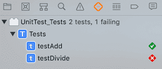
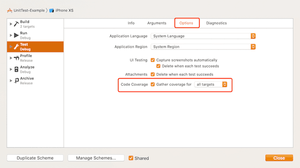
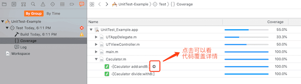
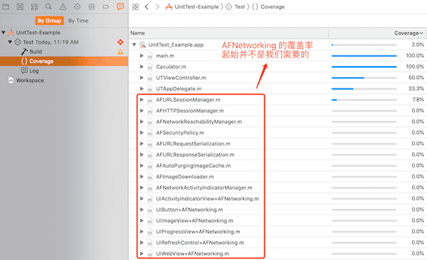
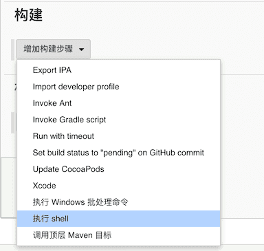
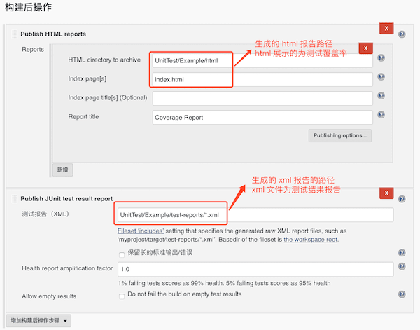
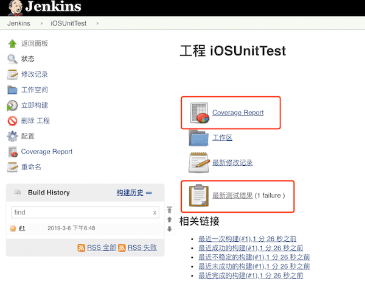
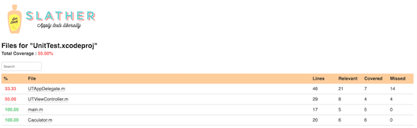

本文主要介绍了 XCode 如何查看 Unit Test 的 Coverage？如何排除 CocoaPods 添加的第三方库对 Coverage 的影响？如何通过 Jenkins 完成自动化测试，并且将结果可视化输出？

### 版本信息
* Xcode - 10.1
* iOS - 12
* Jenkins - 2.135
  *  [JUnit](https://plugins.jenkins.io/junit)  - 1.24
  * [HTML Publisher](https://plugins.jenkins.io/htmlpublisher) - 1.18
* [slather](https://github.com/SlatherOrg/slather) - 2.4.6
* [OCUnit2JUnit](https://github.com/ciryon/OCUnit2JUnit) - 1.4


### 1.基础测试

#### 1.1添加需要测试代码

我是通过 `pod lib create UnitTest` 创建的工程，在工程中添加一下需要测试的代码，实现的是 int 类型的加法和除法

```objc
@interface Caculator : NSObject

- (int)add:(int)a andB:(int)b;

- (int)divide:(int)a withB:(int)b;

@end
    
@implementation Caculator

- (int)add:(int)a andB:(int)b {
    return a + b;
}

- (int)divide:(int)a withB:(int)b {
    return a / b;
}

@end
```


#### 1.2添加测试代码

新建 target - iOS Unit Testing Bundle，在 tests.m 中实现以下代码

```objc
@interface Tests : XCTestCase
@property(nonatomic, strong) Caculator *caculator;
@end

@implementation Tests

- (void)setUp {
    [super setUp];

     self.caculator = [Caculator new];
}

- (void)tearDown {
    // Put teardown code here. This method is called after the invocation of each test method in the class.
    [super tearDown];
}

- (void)testAdd {
    int add = [self.caculator add:1 andB:2];
    XCTAssertEqual(add, 3);
}

- (void)testDivide {
    int divide = [self.caculator divide:3 withB:2];
    XCTAssertEqual(divide, 1.5);
}
@end
```


#### 1.3进行测试

点击测试按钮，可以看到测试结果，除法测试是失败的，因为正确的值应该为 1




### 2.测试覆盖率

#### 2.1 开启 Coverage




#### 2.2 执行测试代码

执行测试代码后可以按以下方法查看测试覆盖率



#### 2.3 去除 CocoaPods 添加的第三方库的覆盖率

加入我在 Podfile 中添加了 `pod AFNetworking` 后再进行一次测试，我们可以看到以下结果。结果中包含了 `AFNetworking` 的覆盖率，但是在我们日常使用中我们只关心自己的代码的覆盖率而不关心第三方库的覆盖率




针对这种情况，可以通过修改 Podfile 文件，使 Coverage 不支持指定 target，如下为一个完整的 Podfile 文件，`pod install` 后再测试，就可以去掉 `AFNetworking` 的覆盖率了。

```ruby
platform :ios, '8.0'

target 'UnitTest_Example' do
  pod 'UnitTest', :path => '../'
  pod 'AFNetworking'
  
  target 'UnitTest_Tests' do
    inherit! :search_paths
  end
end

# Disable Code Coverage for Pods projects
post_install do |installer_representation|
  installer_representation.pods_project.targets.each do |target|
    # 因为是通过 :path 方式添加的 UnitTest 源码，为了避免把这块一起过滤了，这里做一次判断
    # 只有不是 UnitTest 的时候关闭 Coverage 的支持
    if target.name != 'UnitTest'
      target.build_configurations.each do |config|
        config.build_settings['CLANG_ENABLE_CODE_COVERAGE'] = 'NO'
      end
    end
  end
end
```


### 3. Jenkins 集成自动化测试

#### 3.1 安装 jenkins

自行安装

#### 3.2 安装 [OCUnit2JUnit](https://github.com/ciryon/OCUnit2JUnit)

> A script that converts output from OCUnit in xcodebuild to the XML format used by JUnit. This allows for XCode builds on continuos integration servers like Jenkins, complete with test reports!

```
sudo gem install ocunit2junit -n /usr/local/bin
```

#### 3.3 安装 [slather](https://github.com/SlatherOrg/slather)

> Generate test coverage reports for Xcode projects & hook it into CI.

```
sudo gem install slather -n /usr/local/bin
```

#### 3.4 配置 jenkins

##### 3.4.1 安装插件

在插件管理中安装插件 [JUnit](https://plugins.jenkins.io/junit) 和 [HTML Publisher](https://plugins.jenkins.io/htmlpublisher)

##### 3.4.2 新建一个工程 iOSUnitTest

##### 3.4.3 配置工程

###### (1)添加 shell 脚本




```bash
# 删除 UnitTest 文件夹
rm -rf UnitTest
# 从 git clone 项目到 UnitTest 文件夹
git clone --depth=1 https://github.com/Xiaoye220/UnitTest.git UnitTest

cd ${WORKSPACE}/UnitTest/Example

pod install

# 进行测试并通过 ocunit2junit 转化为 JUnit 格式的结果
xcodebuild test -workspace UnitTest.xcworkspace -scheme UnitTest-Example -destination 'platform=iOS Simulator,name=iPhone XS' -configuration Debug -enableCodeCoverage YES 2>&1 | ocunit2junit


# 创建 xml 报告，默认 xml 报告保存在当前目录 test-reports 文件夹
slather coverage --scheme UnitTest-Example --workspace UnitTest.xcworkspace UnitTest.xcodeproj
# 创建 html 报告，默认 html 报告保存路径为前目录 html 文件夹
slather coverage --html --scheme UnitTest-Example --workspace UnitTest.xcworkspace UnitTest.xcodeproj 
```

* 如果项目包含 `xcworkspace` 要指定 `-workspace UnitTest.xcworkspace`
* `-scheme` 为当前测试的 scheme，如果不知道，可以在`xcworkspace` 目录下执行命令 `xcodebuild -list` ，可以看到所有的 scheme
*  `slather` 默认生成为 xml 报告，在当前目录的 `test-reports` 文件夹中
*  `slather`  添加了 `--html` 后会生成 html 报告，在当前目录的 `html` 文件夹中

###### (2) 添加构建后的操作，显示测试结果以及测试覆盖率




###### (3) 立即构建

在构建完后我们可以看到结果




查看测试覆盖率详情




查看测试结果详情


###### (4) html 忽略指定文件的覆盖率

对于上面的结果，我们其实唯一关心的只有 `Caculator.m` 的覆盖率，其余三个文件 `main.m`、`UTAppDelegate.m`、`UTViewController.m`  都不是我们关心的，那么我们可以在生成 html 的时候忽略指定文件，修改 jenkins 构建脚本中生成 html 的命令为以下

```bash
# 创建 html 报告，默认 html 报告保存路径为前目录 html 文件夹
# slather coverage --html --scheme UnitTest-Example --workspace UnitTest.xcworkspace UnitTest.xcodeproj 

# --ignore 后接的是需要忽略文件的路径
# 以上需要忽略的都在当前目录的 UnitTest 文件夹下
slather coverage --html --scheme UnitTest-Example --workspace UnitTest.xcworkspace --ignore 'UnitTest/*' UnitTest.xcodeproj 
```

再次构建，结果就只剩下 `Caculator.m` 的覆盖率了，是不是棒棒哒

### GitHub Demo
[Demo](https://github.com/Xiaoye220/UnitTest)

### 参考资料

[Jenkins实现iOS自动化测试及覆盖率报告输出](https://www.jianshu.com/p/21bb090b200c)
[How to exclude Pods from Code Coverage in Xcode](https://stackoverflow.com/questions/39674057/how-to-exclude-pods-from-code-coverage-in-xcode)