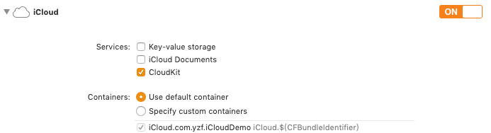
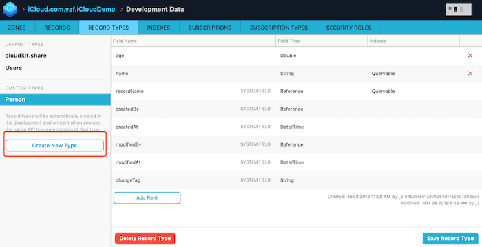
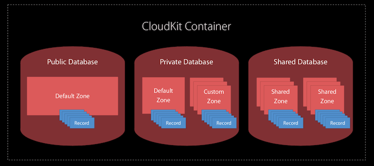

### 1.添加 iCloud 支持



打开 [dashboard](https://icloud.developer.apple.com/dashboard/) 就可以看到添加的 Container 了

我们在 Container 里面添加一个新的 `Record Type` 用于测试， `Record Type`  类似于数据库的表



### 2.CloudKit 概览

iCloud 中各部件的关系如图所示



#### 2.1 CKContainer

一个应用对应一个容器，容器 `identifier` 为 `1.添加 iCloud 支持` 中添加的 

#### 2.2 CKDatabase

一个 app container 可以有三种类型的 database

* publicCloudDatabase：必有的，对任何人设备通用，可以在  [dashboard](https://icloud.developer.apple.com/dashboard/)  查看，数据计入 app 的 iCloud 空间，无法使用 customZone
* privateCloudDatabase ：只能自己的设备访问，无法在  [dashboard](https://icloud.developer.apple.com/dashboard/)  查看别人的数据，数据计入用户个人的 iCloud 空间。把想要分享给别人的数据保存至 customZone，defaultZone 中的数据无法分享
* sharedCloudDatabase：iOS 10 后新增，通过 `UICloudSharingController` 指定共享的用户，将 `privateCloudDatabase` 中的 `customZone` 中的数据共享到指定用户的 `sharedCloudDatabase` 中。`sharedCloudDatabase` 中的数据不占用用户的 iCloud 空间，可以理解为 `sharedCloudDatabase` 中的数据是 共享者的 `privateCloudDatabase` 的映射。

#### 2.3 CKRecordZone

记录区，可以通过添加自定义的 Zone 对数据进行归类

每个 `CKRecordZone` 都有一个 `CKRecordZone.ID`，包含 `zoneName` 和 `ownerName` 信息。`CKRecordZone.default()` 为默认的 zone 对应 privateDatabase 和 publicDatabase 中名字为 `_defautZone` 的 zone

* `zoneName` 在 privateCloudDatabase 中能表示唯一的 zone

* `ownerName` 表示这个 zone 是谁创建的，在 sharedCloudDatabase 中可以用 `ownerName` 区分相同 `zoneName` 的 zone。测试后发现在 privateCloudDatabase 创建自定义 zone 的时候，`ownerName` 必须用 `CKCurrentUserDefaultName`（下面代码有对 `CKCurrentUserDefaultName` 的说明），否则报错

```swift
let database = CKContainer.default().privateCloudDatabase
// creating a custom record zone
let customZone = CKRecordZone(zoneName: "customZone")
database.save(customZone) { (zone, error) in
 	// TODO:
}

// save record to the zone
// CKCurrentUserDefaultName specifies the current user's ID when creating a zone ID
let zoneID = CKRecordZone.ID.init(zoneName: "customZone", ownerName: CKCurrentUserDefaultName)
let recordID = CKRecord.ID.init(recordName: recordName, zoneID: zoneID)
let record = CKRecord(recordType: recordType, recordID: recordID)

database.save(record) { (record, error) in
    // TODO:
}
```

#### 2.4 CKRecord

记录实体类，包含用户自定义的字段以及一些 Metadata。如 `1.添加 iCloud 支持` 中我创建的 Person，其中 name、age 为我自定义的字段，剩下的都是默认添加的 Metadata

`CKRecord.ID` 通过一个 recordName 初始化，recordName 为一条数据的唯一标识符，若是不指定，那么会通过 `UUID().uuidString` 生成一串字符串作为 recordName

#### 2.5 CKReference

表示实体间的关系，如一对一，一对多等


### 3.基础用法

#### 3.1 添加数据

```swift
let database = CKContainer.default().publicCloudDatabase
var record: CKRecord

// 指定 recordID 会将 record name 设置为 "record_Name"，这个是唯一标识符
// recordType 类似于表名，在 iCloud 后台创建
// 对同一 recordID 保存两次会报错
let recordID = CKRecord.ID.init(recordName: "record_Name")
record = CKRecord(recordType: "Person", recordID: recordID)

// 不指定 recordID 会默认通过 `UUID().uuidString` 生成一串字符串作为 record name
record = CKRecord(recordType: "Person")

// 设置 record 键值对
record.setValue("Tommy", forKey: "name")
record.setValue(18, forKey: "age")

// 使用 Convenience API 保存数据
database.save(record) { (record, error) in
    // TODO
}
```

除了上面那种 Convenience API 保存数据外还可以用 CKOperation 执行所有的 iCloud 操作，Convenience API 内部也是通过 CKOperation 实现，只是封装后使用起来更方便。

但是因为 CKOperation 是 NSOperation  的子类，所以可以使用 NSOperation 的所有特性，包括 Operation 的依赖、Quality of service、Cancel 等等重要功能。并且 CKOperation 是批量处理 CKRecord 的，节省网络资源。所以 CKOperation 的可配置度更高，更好的进行资源优化，**能用 CKOperation 尽量都用它实现**

```swift
let operation = CKModifyRecordsOperation(recordsToSave: [record], recordIDsToDelete: nil)
operation.modifyRecordsCompletionBlock = { (records, deletedIds, error) in
	// TODO
}
operation.perRecordCompletionBlock = { (record, error) in
	// TODO
}
database.add(operation)
```

#### 3.2 查找数据

```swift
let recordID = CKRecord.ID.init(recordName: "record_Name")

database.fetch(withRecordID: recordID) { (record, error) in
    // TODO
}

// 通过 CKQuery 查找数据
// 通过这种方式查询数据需要在 dashboard 中的 indexs 中将查询的字段 name 设置为 queryable，否则会报错
let predicate = NSPredicate(format: "name == %@", "Lily")
let queue = CKQuery(recordType: "Person", predicate: predicate)

database.perform(queue, inZoneWith: nil) { (records, error) in
    // TODO                                    
}
```

也可以通过 CKOperation 完成

```swift
let operation = CKFetchRecordsOperation(recordIDs: [recordID])
operation.perRecordCompletionBlock = { (record, recordID, error) in
	// TODO
}
operation.fetchRecordsCompletionBlock = { (recordIDs, error) in
	// TODO
}
database.add(operation)
```

#### 3.3 删除数据

```swift
let recordID = CKRecord.ID.init(recordName: "record_Name")

database.delete(withRecordID: recordID) { (record, error) in
    // TODO
}
```

#### 3.4 修改数据

这里我们会发现一个有趣的问题，我们在 `3.1 添加数据` 中如果保存两条相同 recordID 的数据会报错 `record to insert already exists`，但是在我们下面代码，也是 save 一条已经存在的 recordID 的数据，为什么就可以呢。我把两条 CKRecord 打印出来

```
<CKRecord: 0x7f9f4a00b8e0; recordID=RecordName:(privateZone:__defaultOwner__), recordType=Person>
<CKRecord: 0x7f9f46d2d220; recordID=RecordName:(privateZone:__defaultOwner__), recordChangeTag=v, recordType=Person>
```

我们可以看到下面那条多了一个 `recordChangeTag` 的属性，那么 CloudKit 后台就是根据这个属性做的判断，你当前是更新还是插入

```swift
let recordID = CKRecord.ID.init(recordName: "record_Name")

database.fetch(withRecordID: recordID) { (record, error) in
    if let error = error {
		// TODO 
     } else {
        if let record  = record {
            record.setValue(20, forKey: "age")
            database.save(record) { (record, error) in
                // TODO                       
            }
        }
    }
}
```

#### 3.5 添加 Custom Zone

```swift
let customZone  = CKRecordZone(zoneName: "zone_Name")

database.save(customZone) { (zone, error) in
	// TODO
}
```

#### 3.6 添加 CKRecord 至 Custom Zone

```swift
let zoneID = CKRecordZone.ID.init(zoneName: "zone_Name", ownerName: CKCurrentUserDefaultName)
let recordID = CKRecord.ID.init(recordName: "record_Name", zoneID: zoneID)
let record = CKRecord(recordType: "Person", recordID: recordID)
database.save(record) { (record, error) in
    // TODO
}
```

#### 3.7 获取当前 iCloud 用户唯一标识

```swift
CKContainer.default().fetchUserRecordID { (recordId, error) in
    if let recordId = recordId {
        // recordName 即为唯一标识
        let recordName = recordId.recordName
    }
}
```


> 参考资料
>
> [WWDC 2016 - CloudKit Best Practices](https://developer.apple.com/videos/play/wwdc2016/231/?time=31)
>
> [WWDC 2016 - What's New with CloudKit](<https://developer.apple.com/videos/play/wwdc2016/226>)
>
> [WWDC 2017 - Build Better Apps with CloudKit Dashboard](<https://developer.apple.com/videos/play/wwdc2017/226>)
>
> [CloudKit Quick Start](<https://developer.apple.com/library/archive/documentation/DataManagement/Conceptual/CloudKitQuickStart/Introduction/Introduction.html#//apple_ref/doc/uid/TP40014987-CH1-SW1>)
