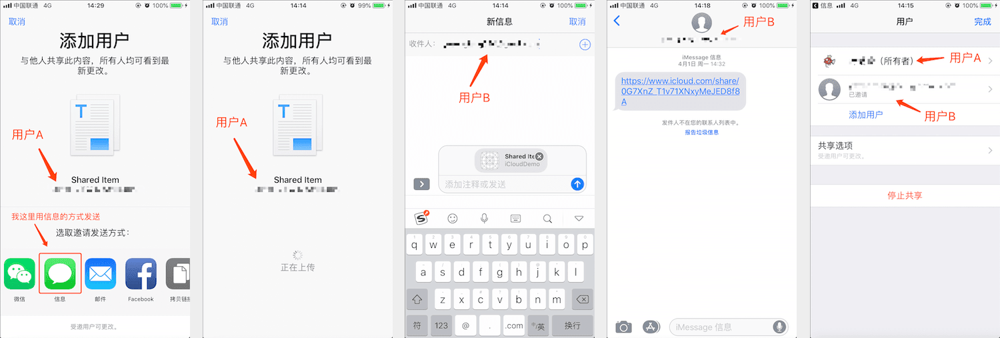

### 1. API 介绍

* CKShare：`CKRecord` 的子类，表示一条共享数据，可以设置权限以及分享用户
* UICloudSharingController：用于将 `share record` 分享给指定用户的界面。会分两种情况显示，一种是未分享过的视图，一种是已经分享过要新增或者删除分享的用户的视图，两者要分清使用场景，用错会报错

- sharedCloudDatabase：iOS 10 后新增，通过 `UICloudSharingController` 指定共享的用户，将 `privateCloudDatabase` 中的 `customZone` 中的数据共享到指定用户的 `sharedCloudDatabase` 中。`sharedCloudDatabase` 中的数据不占用用户的 iCloud 空间，可以理解为 `sharedCloudDatabase` 中的数据是 共享者的 `privateCloudDatabase` 的映射。


### 2. 使用 UICloudSharingController 分享流程

我们定义用户 A 要共享数据给用户 B，那么一个流程就是

1. 用户 A 在 `privateCloudDatabase` 创建一个自定义 `zone`，所有需要分享的 `CKRecord` 都保存在这个 `zone` 中 
2. 用户 A 初始化一个 `UICloudSharingController` ，选择要分享的方式
3. 确认后会首先将 `CKRecord` 保存只自己的 `privateCloudDatabase`
4. 保存完后在 iMessage 中输入要分享的对象（用户B）的账号，发送
5. 用户 B 就会受到 用户 A 发送的一个连接，点击链接会跳转到应用中，接受共享。这里需要注意要在 `info.plist` 中将 `CKSharingSupported` 设置为 `YES`，否则点击链接后会报错
6. 这条 `CKRecord` 已经共享过，然后想要添加、删除共享者的话，可以通过另一种方式初始化 `UICloudSharingController` 显示该操作的页面

一下截图分别对应上面步骤 2 ~ 6



### 3. 代码

#### 3.1 创建自定义 zone

```swift
let customZone  = CKRecordZone(zoneName: "shared_Zone_Name")

privateDatabase.save(customZone) { (zone, error) in
    // TODO
}
```

#### 3.2 初始化 UICloudSharingController

对应上述流程的 ` 2 ~ 5`

这里有几个需要注意的点

* 下面 `rootRecord` 表示的是一个未保存过的数据，如果要分享一个已经保存在 database 的数据，那么需要 fetch 这条 CKRecord，将 fetch 到的 record 作为 rootRecord，原因可以参考 `iCloud 基础 - 3.4`
* `UICloudSharingController` 初始化的 `preparationHandler` 中的 `CKModifyRecordsOperation` 必须同时添加 [rootRecord，shareRecord]，否则会报错
* UICloudSharingController 有两个初始化方法

| 方法                       | 备注                                                         |
| -------------------------- | ------------------------------------------------------------ |
| init(preparationHandler: ) | 分享一个 CKRecord 时，它的 share 属性为空时使用该初始化方法创建 UICloudSharingController，那么 UICloudSharingController 会向 upload CKRecord 和 CKShare 后再分享 |
| init(share:container:)     | 分享一个 CKRecord 时，它的 share 属性不为空，使用该初始化方法因为是一个已经分享过的 record，则可以在 UICloudSharingController 中管理用户 |

```swift
let zoneID = CKRecordZone.ID.init(zoneName: "shared_Zone_Name", ownerName: CKCurrentUserDefaultName)
let recordID = CKRecord.ID.init(recordName: "record_Name", zoneID: zoneID)
// 创建要分享的 CKRecord
let rootRecord = CKRecord(recordType: "Person", recordID: recordID)
rootRecord.setValue("Tommy", forKey: "name")
rootRecord.setValue(28, forKey: "age")

// 创建 CKShare
let shareRecord = CKShare(rootRecord: rootRecord)
// 需要保存的 CKRecord，这里根记录 和 分享记录都需要保存
let recordsToSave = [rootRecord, shareRecord]

// 通过 UICloudSharingController 分享
let sharingController = UICloudSharingController { (controller, completion) in
    let operation = CKModifyRecordsOperation(recordsToSave:recordsToSave, recordIDsToDelete: nil)
    operation.perRecordCompletionBlock = { (record, error) in
        if let error = error {
            // TODO
        }
    }
    operation.modifyRecordsCompletionBlock = { (records, recordID, error) in
        if let error = error {
            DispatchQueue.main.async {
                controller.dismiss(animated: true, completion: nil)
            }
            // TODO
        } else {
            completion(shareRecord, CKContainer.default(), nil)
        }
    }
    CKContainer.default().privateCloudDatabase.add(operation)
}

sharingController.availablePermissions = [.allowReadWrite, .allowPrivate]
sharingController.delegate = self
self.present(sharingController, animated:true, completion:nil)
```

#### 3.3 添加代理，处理收到的分享信息

对应上面流程的 `6`，点击链接后打开应用做的操作

这里需要注意要在 `info.plist` 中将 `CKSharingSupported` 设置为 `YES`，否则点击链接后会报错

```swift
func application(_ application: UIApplication, userDidAcceptCloudKitShareWith cloudKitShareMetadata: CKShare.Metadata) {
    let acceptShareOperation: CKAcceptSharesOperation = CKAcceptSharesOperation(shareMetadatas: [cloudKitShareMetadata])
    
    acceptShareOperation.qualityOfService = .userInteractive
    acceptShareOperation.perShareCompletionBlock = { meta, share, error in
        print("share was accepted")
    }
    acceptShareOperation.acceptSharesCompletionBlock = { error in
        /// Send your user to where they need to go in your app
    }
    CKContainer(identifier: cloudKitShareMetadata.containerIdentifier).add(acceptShareOperation)
}
```

#### 3.4 增加、删除用户

对应上面流程的 `7`

```swift
let zoneID = CKRecordZone.ID.init(zoneName: "shared_Zone_Name", ownerName: CKCurrentUserDefaultName)
let recordID = CKRecord.ID.init(recordName: "record_Name", zoneID: zoneID)

privateDatabase.fetch(withRecordID: recordID) { [weak self] (record, error) in
    guard let `self` = self else {
        return
    }
    if let error = error {
        return;
    }
    if let shareReference = record!.share {
        self.privateDatabase.fetch(withRecordID: shareReference.recordID) { (record, error) in
            guard let shareRecord = record as? CKShare else {
                if let error = error {
                    // TODO
                }
                return
            }
            
            DispatchQueue.main.async {
                let sharingController = UICloudSharingController(share: shareRecord, container: CKContainer.default())
                self.present(sharingController, animated:true, completion:nil)
            }
        }
    }
}
```

### 4. 不使用 UICloudSharingController 分享

上面是用 `UICloudSharingController` 进行分享的，如果我们想使用自定义界面呢，也是可以的

```swift
// ......
// 创建要分享的 CKRecord
let rootRecord = CKRecord(recordType: "Person", recordID: recordID)

// 创建 CKShare
let shareRecord = CKShare(rootRecord: rootRecord)
// 需要保存的 CKRecord，这里根记录 和 分享记录都需要保存
let recordsToSave = [rootRecord, shareRecord]

// 通过 CKModifyRecordsOperation 保存根记录 和 分享记录
let operation = CKModifyRecordsOperation(recordsToSave:recordsToSave, recordIDsToDelete: nil)
operation.perRecordCompletionBlock = { (record, error) in
	// 分享记录 保存成功后可以在这获取到该分享的 url
    if let shareRecord = record as? CKShare, let url = shareRecord.url {
        print(url)
    }
}
operation.modifyRecordsCompletionBlock = { (records, recordID, error) in
    // TODO
}
CKContainer.default().privateCloudDatabase.add(operation)
```

通过上述方法获取到 `shareRecord.url` 以后，可以使用任何方式将 url 发送给想要分享的人即可，而无需通过 `UICloudSharingController` 发送 url

对于一个已经成功分享的记录，也可以直接获取 分享记录的 url、参与者 等信息，可以通过这些信息删除、新增参与者

```swift
// 已经成功分享的  CKRecord
let rootRecord = CKRecord(recordType: "Person", recordID: recordID)

// 获取 CKShare 
if let shareReference = rootRecord.share {
    self.privateDatabase.fetch(withRecordID: shareReference.recordID) { (record, error) in
		if let shareRecord = record as? CKShare {
            // participants 包含了所有的参与者的信息，可以通过这些信息管理参与者
        	let participants = shareRecord.participants
            let url = shareRecord.url
            // 删除参与者
            // shareRecord.removeParticipant(participant)
		}
	}
}
```


> 参考资料
>
> [WWDC 2016 - CloudKit Best Practices](https://developer.apple.com/videos/play/wwdc2016/231/?time=31)
>
> [WWDC 2016 - What's New with CloudKit](<https://developer.apple.com/videos/play/wwdc2016/226>)
>
> [WWDC 2017 - Build Better Apps with CloudKit Dashboard](<https://developer.apple.com/videos/play/wwdc2017/226>)
>
> [CloudKit Quick Start](<https://developer.apple.com/library/archive/documentation/DataManagement/Conceptual/CloudKitQuickStart/Introduction/Introduction.html#//apple_ref/doc/uid/TP40014987-CH1-SW1>)

