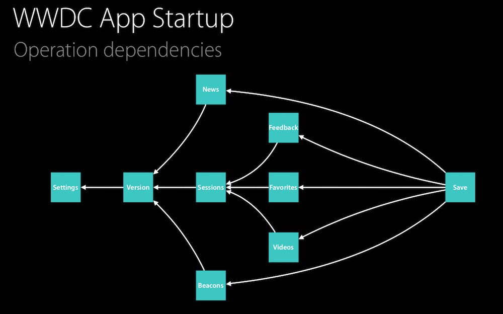

看完 [WWDC 2015 - Advanced NSOperations](<https://developer.apple.com/videos/play/wwdc2015/226/>) 以及 [Sample Code](<https://github.com/bgayman/WWAdvancedOperations>) 了解了他的强大，并不仅仅用在多线程中，并总结一下收获。

正如 WWDC 演讲所说，他们在 WWDC 的应用中重度使用了 NSOperation 来构建他们的应用，将基本操作都封装成一个个 Operation，比如收藏操作、登录操作、展示提示框（没错，还可以用于 UI 展示）等，利用 NSOperation 、NSOperationQueue 的相关特性进行管理各个操作之间的关系。

比如下面就是 WWDC 应用启动的一个流程，后面的操作都依赖与前面的操作完成，通过 NSOperation 添加 Dependency 就可以很好的确保这些操作按顺序执行。提取了代码中的逻辑，将逻辑加到 NSOperation 中，简化逻辑变化。




我们知道 NSOpration 相比 GCD 在以下优势

* 状态管理
* 通过 Dependency 添加依赖
* 控制并发量

在 Sample Code 中，很好的演示了一个地震信息查询的应用是如何通过 NSOperation 驱动的，看完代码确实学到不少东西，比如 NSOperation 的状态管理，合理的使用 Dependency。


### 1. 自定义 Operation

有时候我们想自定义一个 Operation，并且 **管理它的状态**，如果无需管理状态，那么直接重写 main 方法添加自己的操作即可。比如一个网络请求的 Operation，在 add 到 Queue 中执行请求，在请求完成后设置状态为 finished，并执行后面的 Operation，那么可以参考 [Defining a Custom Operation Object](<https://developer.apple.com/library/archive/documentation/General/Conceptual/ConcurrencyProgrammingGuide/OperationObjects/OperationObjects.html#//apple_ref/doc/uid/TP40008091-CH101-SW16>)，一个基本的结构如下。

这里有几点是必须的

* 重写 isExcuting 属性
* 重写 isFinished 属性
* 重写 main 方法

同时看到有些地方说以下内容也需要重写，实际是无需重写的

* start 方法，可以使用用默认的实现，start 方法的主要作用就是在 Operation ready 时作为入口函数，会做一些判断，确定是否要执行 main 方法。如果要重写可以参考下面实现。

* isConcurrent 属性，iOS 7.0 之后用 isAsynchronous 替代，这个属性的作用是直接用 start 方法启动 Operation，而不是 add 到 Queue 中时起作用。为 false 时会在当前线程执行，为 true 会在一个新的线程中执行

还有一个如果想要控制 isReady 状态的话，不能像 isExcuting 和 isFinished 那样我们直接控制，我们需要合并 `super.isReady` 的值， **super.isReady  的值是有当前 Operation 是否有 dependency 决定的**。我们假设我们有 op1 依赖与 op2，我们不考虑 op1 的 super.isReady 而直接将 op1 的 isReady 按照自己的逻辑返回 true，那么此时即便 op2 未完成，因为 op1 的 isReady 为 true，op1 还是会执行，和预期是不一致的。

Operation 的状态管理是通过 KVO 实现的，比如要将设置 isFinished 为 true，会通过 `willChangeValue` 和 `didChangeValue` 触发一个 KVO，那么 OperationQueue 观察到 isFinished 属性改变了，会获取 isFinished 的当前值，发现为 true，那么就会结束当前 Operation，执行后面的 Operation。

```swift
class MyOperation: Operation {
    
    var myExcuting = false
    var myFinished = false

    override var isExecuting: Bool {
        return myExcuting
    }
    
    override var isFinished: Bool {
        return myFinished
    }
    
//    override var isConcurrent: Bool {
//        return true
//    }
    
    override func start() {
        // Always check for cancellation before launching the task.
        if(self.isCancelled) {
            // Must move the operation to the finished state if it is canceled.
            self.willChangeValue(forKey: "isFinished")
            myFinished = true
            self.didChangeValue(forKey: "isFinished")
            return
        }
        
        // If the operation is not canceled, begin executing the task.
        self.willChangeValue(forKey: "isExecuting")
        Thread.detachNewThreadSelector(#selector(main), toTarget: self, with: nil)
        myExcuting = true
        self.didChangeValue(forKey: "isExecuting")
    }
    
    override func main() {
        // TODO 添加网络请求等操作
        // 在任务执行完毕调用 completeOperation() 
        completeOperation()
    }
    
    func completeOperation() {
        self.willChangeValue(forKey: "isFinished")
        self.willChangeValue(forKey: "isExecuting")
        
        myExcuting = false
        myFinished = true
        
        self.didChangeValue(forKey: "isExecuting")
        self.didChangeValue(forKey: "isFinished")
    }
}
```


### 2. Operation 状态管理

在 NSOperation 中原有的有四种状态

1. isReady
2. isExcuting
3. isFinished
4. isCancelled

但是在 Sample Code 中却定义了以下状态，主要是为了方便为每个 Operation 进入 ready 状态前执行一些前置条件（Condition）

```swift
fileprivate enum State: Int {
    case initialized
    case pending
    case evaluatingConditions
    case ready
    case executing
    case finishing
    case finished
}
```

我们先不管上面的七个状态，主要看看原本自带的四种状态

#### isReady

isReady 状态用来标记 Operation 是否可以开始执行了。isReady 的值取决于其依赖的 Operations 是否执行完毕，如果有依赖的 Operation 未执行完毕，那么 isReady 为 false。只有 isReady 为 true，才能执行 Operation 的 start 方法。对于想要自己控制 isReady 状态的话，我们需要合并 `super.isReady` 的值，原因在上面也提到了

比如我们看 Sample Code 中的一段代码，对于 isReady 的值设计到 `super.isReady` 和 `isCancelled`，为啥和 isCancelled 有关呢，下面说

```swift
override var isReady: Bool {
    switch state {
    // ...
    case .ready:
        return super.isReady || isCancelled
    default:
        return false
    }
}
```


#### isExcuting

就是字面意思，用于判断当前 main 中的任务是否正在执行


#### isFinished

用于判断任务是否执行完毕，通过 KVO 设置 Operation 的 isFinished 为 true 可以使 OperationQueue 移除当前 Operation 并执行后面的 Operation


#### isCancelled

* 当 Operation 还未执行时，比如说依赖其他 Operation 正在等待的时候，此时调用 `cancel()` 方法时，会将 isCancelled 设置为 true，isReady 设置为 true。因为 isReady 为 true 了，因此也无需等待其依赖的 Operation 执行完毕，会执行 start 方法，我们看`1.自定义 Operation` 中 start 的实现，会判断 isCancelled 是否为 true，为 true 就不执行 mian 方法了，也就将取消掉了当前 Operation
* 对于已经执行的 Operation，调用 `cancel()`  方法并不会将当前 Operation 取消，它只会将 isCancelled 标记为 true，那么对于 main 中的任务的取消需要我们手动根据 isCancelled 去取消。同时取消了任务后，还是需要将 isFinished 标记为 true


### 3. Operation 条件控制

在 Sample Code 中，BaseOperation 有个属性 `conditions`，声明了一个 Operation 执行前的条件

```swift
fileprivate(set) var conditions = [OperationCondition]()
```

```swift
protocol OperationCondition {
    static var name: String { get }
    static var isMutuallyExclusive: Bool { get }
    
    func dependency(for operation: BaseOperation) -> Operation?
    func evaluate(for operation: BaseOperation, completion: @escaping (OperationConditionResult) -> ())
}
```

* `name`

  对于每一个实现了该协议的类都返回一个 name

* `isMutuallyExclusive`

  返回是否是否互斥。对于两个 Operation op1 和 op2，如果 op1 和 op2 都含有一个 name  相同的 condition，并且 condition 的 isMutuallyExclusive 为 true。那么在 OperationQueue 将 op1 和 op2 加入 Queue 时，会自动将 op2 设置为 op1 的依赖，那么 op1 和 op2 就形成一个互斥的操作了

* `func dependency(for operation: BaseOperation) -> Operation?`

  这里返回所有需要依赖的 Operation，会在一个 Operation 加入 Operation 时自动为其添加依赖

* `func evaluate(for operation: BaseOperation, completion: @escaping (OperationConditionResult) -> ())`

  这里定义的操作会在 Operation 变成 Ready 状态之前执行


对于一些需要在 Operation 完成后额外添加的的任务，比如对于一个网络请求 Operation 失败的时候执行一个 弹框警告的 Operation 的时候。

Sample Code 通过给 BaseOperation 添加 OperationObserver 来实现

```swift
protocol OperationObserver {
    func operation(didStart operation: BaseOperation)
    func operation(_ operation: BaseOperation, didProduce newOperation: Operation)
    func operation(didFinish operation: BaseOperation, errors: [NSError])
}
```

在 Operation 添加至 OperationQueue 的时候，会创建一个 OperationObserver 来观察 operation 的执行过程，当 Operation `didProduce newOperation` 时，会将其将如 Queue 中，保证任务的连贯性。

```swift
class BaseOperationQueue: OperationQueue {
    weak var delegate: BaseOperationQueueDelegate?
    
    override func addOperation(_ op: Operation) {
        if let op = op as? BaseOperation {
            let delegate = BlockObserver(startHandler: nil,
                                         produceHandler: { [weak self] in
                                            self?.addOperation($1)
                },
                                         finishHandler: { [weak self] in
                                            if let q = self {
                                                q.delegate?.operationQueue?(q, didFinish: $0, with: $1)
                                            }
            })
            
            op.add(delegate)
           // ......
    }
}
```


Sample Code 主要就是通过以上两种方式来管理各个 Operation 之间的逻辑的。

通过看 Sample Code 的实现，以及 WWDC 中的介绍，我们还是能学习到如何通过 Operation 去构建一个应用或者说去实现某些逻辑性复杂的功能。