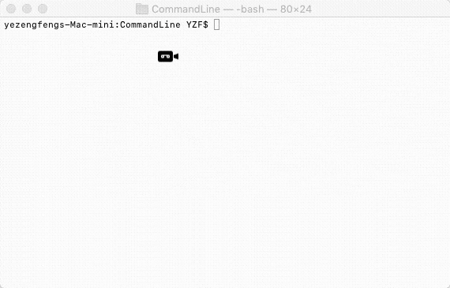

最近找 WWDC 的字幕资源时，找到一个挺好的工具 [WWDCHelper](<https://github.com/kingcos/WWDCHelper>) 瞬间觉得有一个自己的命令行工具那简直装逼能力 Max 啊。看了一下，大部分都是使用 [Swift Package Manager](<https://swift.org/package-manager/>) 实现的，但是我在 XCode 中新建 Project 找到一个 Command Line Tool 选项，使用它构建命令行工具更加方便

让开始构建一个装逼利器 Command Line Tool ，同时，也确实可以简化我们很多的工作。


### 1. 基础

首先先新建一个 Command Line Tool 工程


看看我们要实现的一个效果

* 输入 `yzf --helloworld` ，输出 "HELLO WORLD"
* 输入 `yzf --add_tag 1.0.0`，如果 git 没有 `1.0.0` 的 tag，则新增该 tag；如果已经存在 `1.0.0` 版本的 tag，则删除旧的 tag 重新添加 tag。这个是我在组件化时经常需要执行的操作，这样子就可以简化操作，一行命令就 OK
* 输入 `yzf --sum` 后，输入 n 个数字，计算输入数字的和





#### 1.1 代码

我们代码都在新建完工程后的 `main.swift` 文件中编写，所有的代码逻辑和写 iOS 应用是一样的

##### 1. 实现 —helloworld

```swift
// Swift.CommandLine 为自带的类
// Swift.CommandLine.arguments 获取所有命令行的参数
// 比如输入 yzf --time，那么 args = ["yzf", "--time"]
let args = Swift.CommandLine.arguments

// 判断参数是否为 --helloworld
if args[1] == "--helloworld" {
    let helleworld = """
         _   _      _ _    __        __         _     _
        | | | | ___| | | __\\ \\      / /__  _ __| | __| |
        | |_| |/ _ \\ | |/ _ \\ \\ /\\ / / _ \\| '__| |/ _` |
        |  _  |  __/ | | (_) \\ V  V / (_) | |  | | (_| |
        |_| |_|\\___|_|_|\\___/ \\_/\\_/ \\___/|_|  |_|\\__,_|

    """
    print(helleworld)
}
```


##### 2. 实现 —add_tag

```swift
// 输入 yzf --add_tag 1.0.0
// args = ["yzf", "--add_tag", "1.0.0"]
let args = Swift.CommandLine.arguments

if args[1] == "--add_tag" {
    // 获取 tag 版本 1.0.0
    let tag = args[2]
    
    // 相当于 MacOS OC 中的 NSTask，可以调用外部程序或脚本
    // Process 的用法可以参考 NSTask，大家自行搜索了
    let process = Process()
    process.launchPath = "/bin/bash"
    
    // 自己编写的一段 add tag 的脚本
    let cmd = """
    tag=\(tag)
    
    git pull --tags
    existTag=$(git tag -l | grep $tag)
    
    if [ "${existTag}" != "" ]
    then
    
    git tag -d ${tag}
    git push origin :refs/tags/${tag}
    
    fi
    
    git tag -a ${tag} -m ${tag}
    git push origin --tags
    """
    
    process.arguments = ["-c", cmd]
    process.launch()
    process.waitUntilExit()
}
```


##### 3. 实现 —sum

```swift
if args[1] == "--sum" {
    print("输入数字，以空格隔开")
    
    // 读取用户输入的值
    let keyboard = FileHandle.standardInput
    let inputData = keyboard.availableData
    var strData = String(data: inputData, encoding: String.Encoding.utf8)!
    // 删除最后的换行符
    strData.removeLast()
    
    let nums = strData.components(separatedBy: " ")
    let sum = nums.reduce(0) { (result, num) -> Int in
        return result + Int(num)!
    }
    
    print("输入数字的和为 \(sum)")
}
```


#### 1.2 可执行文件

我们编写玩 `main.swift` 后，XCode build 一下，会在 `Products` 生成一个可执行文件


我们右键 `Show in Finder` 后，在 Terminal 中当前路径下执行以下命令，将该可执行文件拷贝到指定路径下，那么我们就可以用 `yzf` 调用命令行了

```bash
cp CommandLine /usr/local/bin/yzf
```


#### 1.3 Run Script

对于每次编译后生成的可执行文件，如果都要通过 `cp CommandLine /usr/local/bin/yzf` 手动去拷贝，显然很麻烦，我们利用 XCode - Build Phases 中 Run Script 功能，在每次编译后自动执行以下命令，那么我们就只要编译即可

```bash
cp $BUILT_PRODUCTS_DIR/$PRODUCT_NAME /usr/local/bin/yzf
```


### 2. 进阶

仔细看看  [WWDCHelper](<https://github.com/kingcos/WWDCHelper>) 、[onevcat/FengNiao](<https://github.com/onevcat/FengNiao>)，都会提供一个 `--help` 显示提示信息，并且可以改变 Terminal 输出的文字的颜色，就像下面这种效果


我们要实现这些效果，可以使用两个第三方库 [CommandLineKit](<https://github.com/jatoben/CommandLine>)、[Rainbow](https://github.com/onevcat/Rainbow.git)，一个用于解析命令行输入，一个用于改变命令行输出字体颜色。但是对于添加第三方库，由于 Command Line Tool 使用 CocoaPods 添加的话，编译的时候会报错，所有我为了方便，直接将源码加入工程中


两个库的具体使用可以参考各自 Github 上的 README

这么贴一下我 `main.swift` 中的代码

```swift
let cli = CommandLine()

cli.formatOutput = { s, type in
    var str: String
    switch(type) {
    case .error:
        str = s.red.bold
    case .optionFlag:
        str = s.green.underline
    case .optionHelp:
        str = s.blue
    default:
        str = s
    }

    return cli.defaultFormat(s: str, type: type)
}

let help = BoolOption(shortFlag: "h", longFlag: "help",
                      helpMessage: "-h --help，帮助信息")

let git_add_tag = StringOption(longFlag: "git_add_tag",
                               helpMessage: "--git_add_tag [tag]，给 git 添加 tag，已存在则删除原有的再次添加")


cli.addOptions(help)
cli.addOptions(git_add_tag)

do {
    try cli.parse()
} catch {
    cli.printUsage(error)
    exit(EX_USAGE)
}

if Swift.CommandLine.arguments.count == 1 || help.value {
    cli.printUsage()
    exit(EX_OK)
}

/* Git Operation */
if let value = git_add_tag.value {
    // 执行 add tag 的操作，需要自己去实现
    // GitOperation.addTag(value)
}
```


> 参考资料

> [WWDCHelper](<https://github.com/kingcos/WWDCHelper>) 

> [onevcat/FengNiao](<https://github.com/onevcat/FengNiao>)

> [Swift Package Manager](<https://swift.org/package-manager/>) 