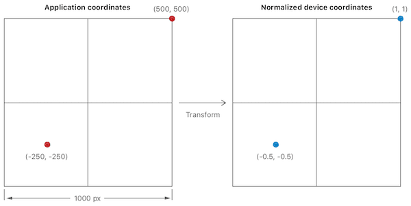
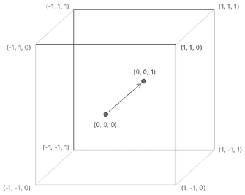
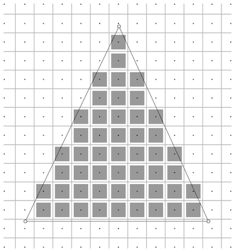
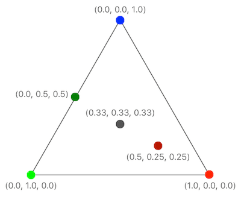

上一篇介绍了如何通过 `MTKView` 和 `render pass` 修改 view 的 contents。这一篇介绍如何通过渲染管线（`render pipeline`）绘制一个三角形。

 <!--more-->

先上一个 [Demo](<https://github.com/Xiaoye220/Demos/tree/master/MetalDemo>)

这里渲染管线可以说是整个 `render pass` 的一部分，渲染管线是什么

> 渲染管线，实际上指的是一堆原始图形数据途经一个输送管道，期间经过各种变化处理最终出现在屏幕的过程。通常情况下，渲染管线有三个阶段，其中光栅化阶段不可编程，其他两个可以
> 1. 顶点着色器（vertex stage），接收一组顶点数据数组，来限定显示／处理区域
> 2. 光栅化阶段（rasterization stage），在光栅化阶段，确定哪些像素位于边界，裁剪超出边界的像素
> 3. 片段着色器（fragment stage），计算每一个像素最终的颜色值


通过第二篇文章中的 `commands` 、`textures` 的说明，渲染管线可以更具体的理解成这样的一个过程

> 处理所有的所有的绘制相关的 commands，并且将处理后的数据保存在 textures 的过程


对渲染管线有所了解后下面通过代码看看是如何运作的，按照 Sample Code 的顺序讲讲其中自己对于其中代码的理解

#### 1. 声明结构体

创建一个头文件 `RPShaderTypes.h` ，在其中声明以下内容

```swift
// RPShaderTypes.h
#ifndef RPShaderTypes_h
#define RPShaderTypes_h

#include <simd/simd.h>

// 这个结构体定义了顶点的信息
// 该头文件中定义的类型可以被 .metal 文件以及相应的 C 语言文件使用
typedef struct
{
    // vector_float2 是一个包含了两个浮点数的类型，用于表示 x 和 y 轴，取值为 -1 ~ 1
    vector_float2 position;
    // vector_float4 用于表示颜色的 RGBA 信息
    vector_float4 color;
} RPVertex;

// 用来区分顶点着色器输入参数对应的下标，它指明我们的数据是存放在哪块内存区域
typedef enum RPVertexInputIndex
{
    RPVertexInputIndexVertices     = 0,
    RPVertexInputIndexViewportSize = 1,
} RPVertexInputIndex;

#endif /* RPShaderTypes_h */
```

这里的类型使用的是 `SIMD` 中的定义类型，如以上的 `vector_float2`、`vector_float4` 都是，通过 `#include <simd/simd.h>` 引入。`SIMD` 在使用 Metal 过程中非常常见。


#### 2. 实现顶点着色器处理方法

接着实现 渲染管线 第一阶段 `vertex stage` 处理的方法，我们新建一个 `metal` 文件




实现以下代码，编写 Metal 文件用到的语言是 `Metal Shading Language`，和 C++ 非常相似，它是基于 C++14 延伸出来的一个子集，针对 Metal，扩展了一些其他的特性、关键字

```swift
// RPShaders.metal

#include <metal_stdlib>
using namespace metal;

#include "RPShaderTypes.h"

// 顶点着色器阶段处理后完，要进入片段着色器需要的一个数据类型
typedef struct
{
    // 表示顶点着色器阶段经过 vertex function 处理后的位置信息
    // 这里会将原先 vector_float2 类型的 position 转换成 float4 的 position，即将二元向量转换为四元向量
    // [[position]] 修饰符用于声明该参数表示的是 position 信息
    float4 position [[position]];
    
    // 这里的颜色会根据顶点的颜色进行插值计算
    // float4 等价于 RPVertex 中的 vector_float4
    float4 color;
    
} RasterizerData;

// vertex 关键字声明 vertex Function，根据输入的顶点信息输出 RasterizerData
// [[vertex_id]] 修饰符是一个 Metal 关键字，GPU 每次调用该方法时会传入一个唯一值作为 id
// [[buffer(n)]] 修饰符
// 参数 vertices 就是一个 RPVertex 数组
// 参数 viewportSizePointer 表示一个三角形会被绘制的区域，该例中即为整个屏幕区域
vertex RasterizerData
vertexShader(uint vertexID [[vertex_id]],
             constant RPVertex *vertices [[buffer(RPVertexInputIndexVertices)]],
             constant vector_uint2 *viewportSizePointer [[buffer(RPVertexInputIndexViewportSize)]])
{
    RasterizerData out;
    
    // 根据 vertexID 从 vertices 获取当前的顶点 x 和 y 轴信息
    float2 pixelSpacePosition = vertices[vertexID].position.xy;
    
    // 获取三角形会被绘制的区域
    vector_float2 viewportSize = vector_float2(*viewportSizePointer);
    
    // 这里的 position 转换，需要将二元向量，处理为四元向量（xyzw）。
    // 只是三角形是基于二维平面的，所以我们用到 xy 即可，zw 固定设置成（0.0, 1.0）即可
    // z 轴一般用来描述深度，它代表一个像素在空间中和你的距离，因为我们要放在平面上，所以设置成 0。没有特殊操作的情况下，W 轴默认都设置为 1.0
    out.position = vector_float4(0.0, 0.0, 0.0, 1.0);
    
    // 这里是将坐标系转换成一个左下角为 （-1，-1） 右上角为（1， 1）的坐标系，即 x 和 y 的值均为 -1 ~ 1
    // 比如 viewportSize 为 （1000， 1000），那么整个坐标系就是一个左下角为（-500， -500）右上角为（500，500）的坐标系
    // 假设 pixelSpacePosition 为 （-250， -250），那么转换后的 xy 坐标为（-0.5，-0.5）
    out.position.xy = pixelSpacePosition / (viewportSize / 2.0);
    
    // 拷贝 color 至 out 中
    out.color = vertices[vertexID].color;
    
    return out;
}
```

以上代码主要做的一个事情就是定点坐标系的转换，从二维的 XY 坐标系转换为 `Normalized device coordinate system`，那么这是一个怎么样的坐标系呢，我们看下图

1. 首先这是一个三维的，由 XYZW 构成



2. 其次 XYZW 的取值范围为 -1~1，一个坐标转换过程可以如下表示


#### 3.光栅化阶段

由于 渲染管线 第二阶段光栅化阶段（rasterization stage）不能编码控制，无需处理。

光栅化阶段首先会裁剪中心在三角形外的像素点



接着会对每个像素点的颜色进行插值计算




#### 4. 实现片段着色器处理方法

我们接着实现 渲染管线 第三阶段 `fragment stage` 处理的方法，在 metal 文件中继续添加以下代码。会对上面那个三角形中每个像素点调用 `Fragment Function`

```swift
// RPShaders.metal

// fragment 关键字声明 fragment function
// [[stage_in]] 修饰符声明该参数是光栅化后输出的值
// 光栅化会对每个像素计算出相应的 RasterizerData 后将其作为参数调用 fragment function
fragment float4 fragmentShader(RasterizerData in [[stage_in]])
{
    // 光栅化会根据顶点颜色对每个片段进行插值处理，获取对应的颜色
    // 这里直接返回了光栅化计算好的插值计算后的颜色
    return in.color;
}
```


#### 5. Renderer 实现

和第二篇文章中类似，我们需要自己实现一个 Renderer

```swift
import MetalKit
import simd

class RPRenderer: NSObject, MTKViewDelegate {
    
    var mtkView: MTKView
    
    var device: MTLDevice
    
    var commandQueue: MTLCommandQueue
    
    var pipelineState: MTLRenderPipelineState!
    
    var viewportSize: vector_uint2 = vector_uint2()
    
    init(with mtkView: MTKView) {
        self.mtkView = mtkView
        self.device = mtkView.device!
        self.commandQueue = self.device.makeCommandQueue()!
        
        let defaultLibrary: MTLLibrary = self.device.makeDefaultLibrary()!
        // 获取对应的 Vertex Function，即在 metal 文件中声明的方法 vertexShader
        let vertexFunction: MTLFunction = defaultLibrary.makeFunction(name: "vertexShader")!
        // 获取对应的 Fragment Function，即在 metal 文件中声明的方法 fragmentShader
        let fragmentFunction: MTLFunction = defaultLibrary.makeFunction(name: "fragmentShader")!

        let pipelineStateDescriptor: MTLRenderPipelineDescriptor = MTLRenderPipelineDescriptor()
        pipelineStateDescriptor.label = "Simple Pipeline"
        pipelineStateDescriptor.vertexFunction = vertexFunction
        pipelineStateDescriptor.fragmentFunction = fragmentFunction
        // 设置 render targets 的 pixelFormat，即每个像素在内存中布局的格式
        // 本例中只有一个 render target，并且由 MTKView 提供，因此直接取索引 0 的赋值为 MTKView 的 colorPixelFormat
        // 渲染管线会将 fragment function 输出的内容按照 pixelFormat 的内存排布进行转换
        pipelineStateDescriptor.colorAttachments[0].pixelFormat = mtkView.colorPixelFormat
        
        do {
            self.pipelineState = try self.device.makeRenderPipelineState(descriptor: pipelineStateDescriptor)
        } catch {
            print(error)
        }
    }
    
    /// Called whenever view changes orientation or is resized
    func mtkView(_ view: MTKView, drawableSizeWillChange size: CGSize) {
        self.viewportSize.x = UInt32(size.width)
        self.viewportSize.y = UInt32(size.height)
    }
    
    func draw(in view: MTKView) {
        // 声明三个顶点
        let triangleVertices = [RPVertex(position: vector_float2([250, -250]), color: vector_float4([1, 0, 0, 1])),
                                RPVertex(position: vector_float2([-250, -250]), color: vector_float4([0, 1, 0, 1])),
                                RPVertex(position: vector_float2([0, 250]), color: vector_float4([0, 0, 1, 1]))]
        
        let commandBuffer = self.commandQueue.makeCommandBuffer()!
        commandBuffer.label = "MyCommand"
        
        if let renderPassDescriptor: MTLRenderPassDescriptor = view.currentRenderPassDescriptor {
            let renderEncoder: MTLRenderCommandEncoder = commandBuffer.makeRenderCommandEncoder(descriptor: renderPassDescriptor)!
            renderEncoder.label = "MyRenderEncoder"
            
            // 设置可视区域 viewport
            let viewport = MTLViewport(originX: 0, originY: 0, width: Double(self.viewportSize.x), height: Double(self.viewportSize.y), znear: 0, zfar: 1)
            renderEncoder.setViewport(viewport)
            // 设置渲染管线状态对象 pipelineState
            renderEncoder.setRenderPipelineState(self.pipelineState)
            
            // 设置顶点参数，根据 index 的不同对应不同的内存区域
            // 以下两个方法会将参数传入 metal 文件的 Vertex Function 中执行
            renderEncoder.setVertexBytes(triangleVertices, length: MemoryLayout<RPVertex>.size * 3, index: Int(RPVertexInputIndexVertices.rawValue))
            renderEncoder.setVertexBytes(&self.viewportSize, length: MemoryLayout<vector_uint2>.size, index: Int(RPVertexInputIndexViewportSize.rawValue))
            
            // 绘制三角形
            renderEncoder.drawPrimitives(type: .triangle, vertexStart: 0, vertexCount: 3)
            
            renderEncoder.endEncoding()
            
            commandBuffer.present(view.currentDrawable!)
        }
        
        commandBuffer.commit()
    }
    
}
```


#### 参考资料

> [Using a Render Pipeline to Render Primitives](https://developer.apple.com/documentation/metal/using_a_render_pipeline_to_render_primitives)
>
> [Metal【4】—— 实战，三角形](https://xiaozhuanlan.com/topic/6503719284)