Copied from [一文讲透 Git 底层数据结构和原理, ](https://mp.weixin.qq.com/s/l5JU9e6_HrS_-ixiBIrqsA)侵删. It's really worth to read. 

<!--more-->

### 1. 状态模型

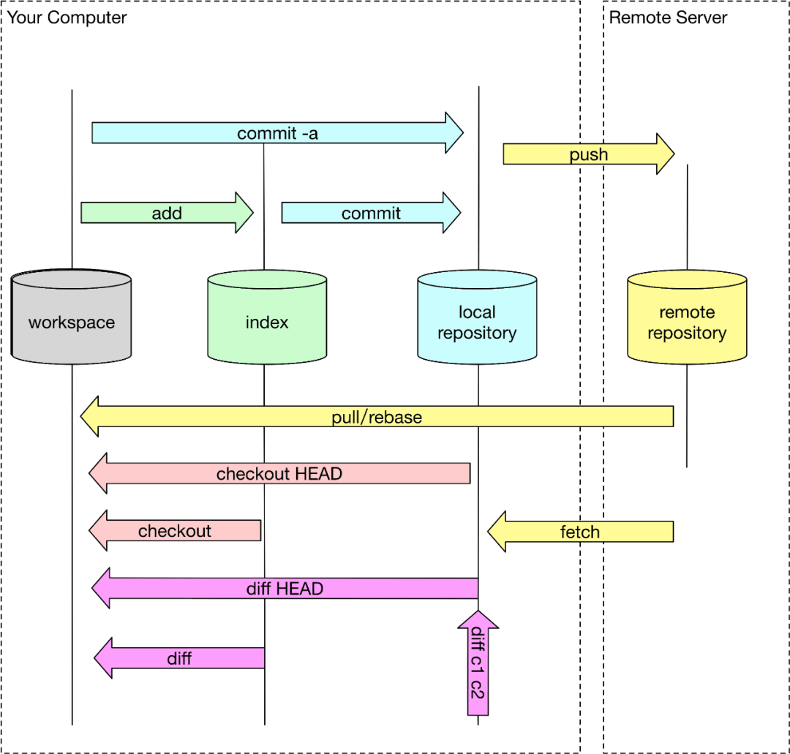


上图描述了 git 对象的在不同的生命周期中不同的存储位置，通过不同的 git 命令改变 git 对象的存储生命周期。

#### 工作区 (workspace)

就是我们当前工作空间，也就是我们当前能在本地文件夹下面看到的文件结构。初始化工作空间或者工作空间 clean 的时候，文件内容和 index 暂存区是一致的，随着修改，工作区文件在没有 add 到暂存区时候，工作区将和暂存区是不一致的。

#### 暂存区 (index)

老版本概念也叫 Cache 区，就是文件暂时存放的地方，所有暂时存放在暂存区中的文件将随着一个 commit 一起提交到 local repository 此时 local repository 里面文件将完全被暂存区所取代。暂存区是 git 架构设计中非常重要和难理解的一部分。

#### 本地仓库 (local repository)

git 是分布式版本控制系统，和其他版本控制系统不同的是他可以完全去中心化工作，你可以不用和中央服务器 (remote server) 进行通信，在本地即可进行全部离线操作，包括 log，history，commit，diff 等等。完成离线操作最核心是因为 git 有一个几乎和远程一样的本地仓库，所有本地离线操作都可以在本地完成，等需要的时候再和远程服务进行交互。

#### 远程仓库 (remote repository)

中心化仓库，所有人共享，本地仓库会需要和远程仓库进行交互，也就能将其他所有人内容更新到本地仓库把自己内容上传分享给其他人。结构大体和本地仓库一样。

#### 文件操作例子

文件在不同的操作下可能处于不同的 git 生命周期，下面看看一个文件变化的例子。


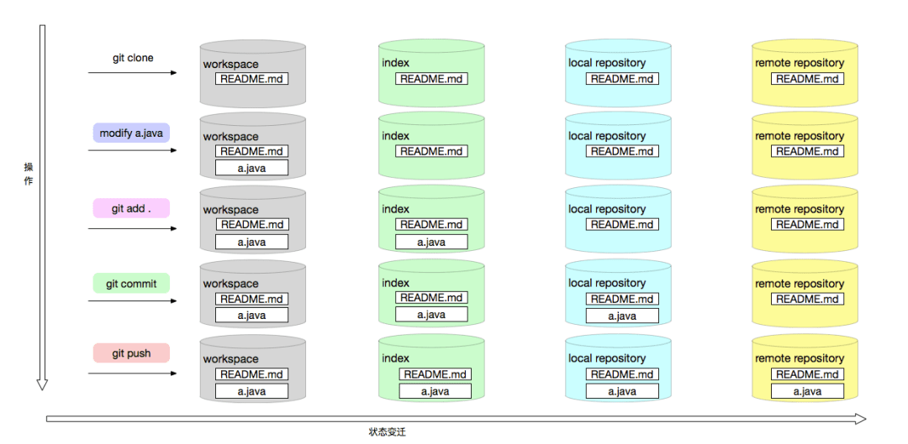


### 2. 对象模型

#### 仓库结构

git 分布式的一个重要体现是 git 在本地是有一个完整的 git 仓库也就是 .git 文件目录，通过这个仓库，git 就可以完全离线化操作。在这个本地化的仓库中存储了 git 所有的模型对象。下面是 git 仓库的 tree 和相关说明：

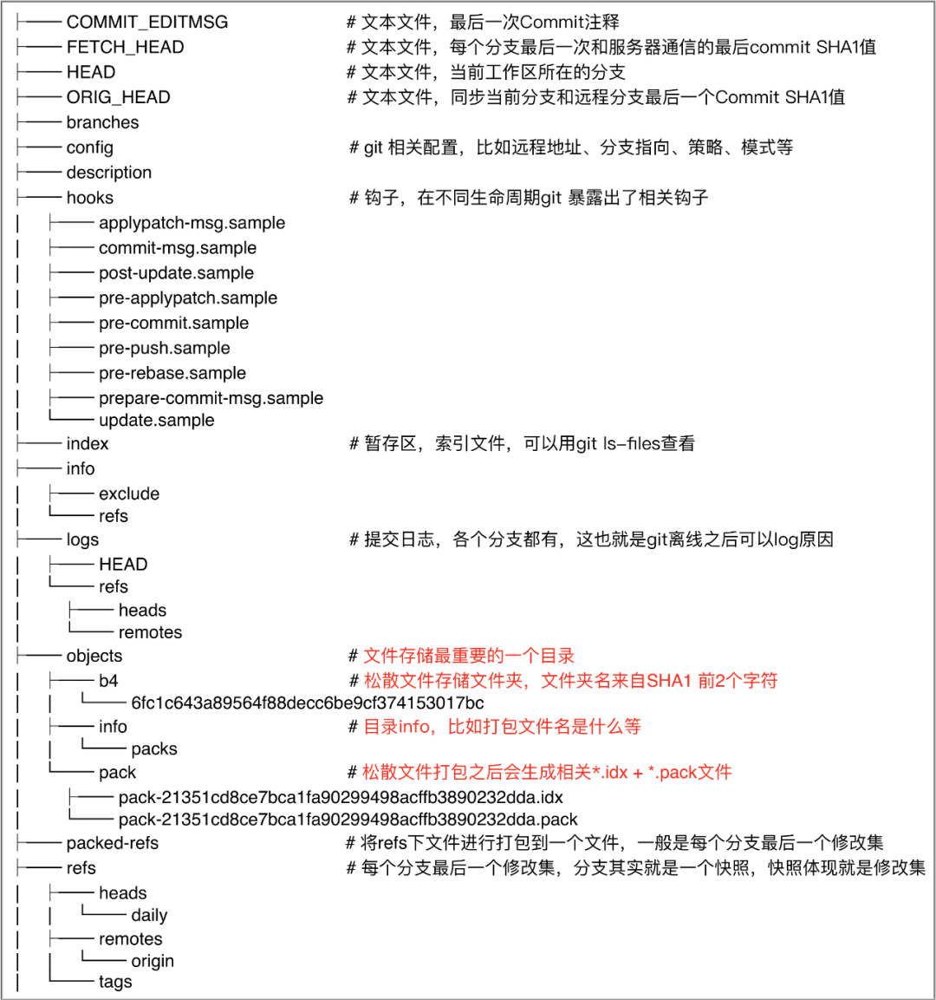


git 主要有四个对象，分别是 Blob，Tree， Commit， Tag 他们都用 SHA-1 进行命名。

你可以用 git cat-file -t 查看每个 SHA-1 的类型，用 git cat-file -p 查看每个对象的内容和简单的数据结构。git cat-file 是 git 的瑞士军刀，是底层核心命令。

#### Blob 对象

只用于存储单个文件内容，一般都是二进制的数据文件，不包含任何其他文件信息，比如不包含文件名和其他元数据。

#### Tree 对象

对应文件系统的目录结构，里面主要有：子目录 (tree)，文件列表 (blob)，文件类型以及一些数据文件权限模型等。

如下图输出：

```shell
→ git cat-file -t ed807a4d010a06ca83d448bc74c6cc79121c07c3
tree
→ git cat-file -p ed807a4d010a06ca83d448bc74c6cc79121c07c3
100644 blob 36a982c504eb92330573aa901c7482f7e7c9d2e6    .cise.yml
100644 blob c439a8da9e9cca4e7b29ee260aea008964a00e9a    .eslintignore
100644 blob 245b35b9162bec4ef798eb05b533e6c98633af5c    .eslintrc
100644 blob 10123778ec5206edcd6e8500cc78b77e79285f6d    .gitignore
100644 blob 1a48aa945106d7591b6342585b1c29998e486bf6    README.md
100644 blob 514f7cb2645f44dd9b66a87f869d42902174fe40    abc.json
040000 tree 8955f46834e3e35d74766639d740af922dcaccd3    cli_list
100644 blob f7758d0600f6b9951cf67f75cf0e2fabcea55771    dep.json
040000 tree e2b3ee59f6b030a45c0bf2770e6b0c1fa5f1d8c7    doc100644 blob e3c712d7073957c3376d182aeff5b96f28a37098    index.js
040000 tree b4aadab8fc0228a14060321e3f89af50ba5817ca    lib
040000 tree 249eafef27d9d8ebe966e35f96b3092d77485a79    mock
100644 blob 95913ff73be1cc7dec869485e80072b6abdd7be4    package.json
040000 tree e21682d1ebd4fdd21663ba062c5bfae0308acb64    src
040000 tree 91612a9fa0cea4680228bfb582ed02591ce03ef2    static
040000 tree d0265f130d2c5cb023fe16c990ecd56d1a07b78c    task
100644 blob ab04ef3bda0e311fc33c0cbc8977dcff898f4594    webpack.config.js
100644 blob fb8e6d3a39baf6e339e235de1a9ed7c3f1521d55    webpack.dll.config.js
040000 tree 5dd44553be0d7e528b8667ac3c027ddc0909ef36    webpack
```


详细解释如下：

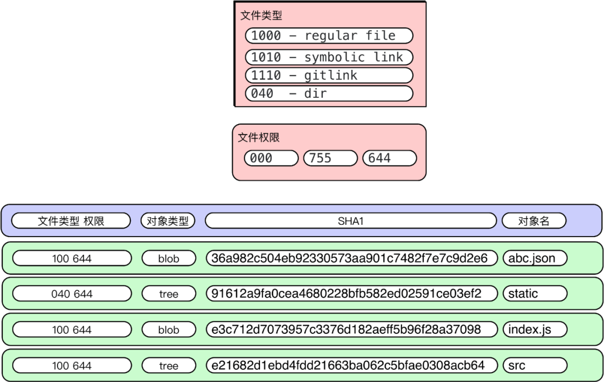


#### Commit 对象

是一次修改的集合，当前所有修改的文件的一个集合，可以类比一批操作的“事务”。是修改过的文件集的一个快照，随着一次 commit 操作，修改过的文件将会被提交到 local repository 中。通过 commit 对象，在版本化中可以检索出每次修改内容，是版本化的基石。

```shell
→ git cat-file -t fbf9e415f77008b780b40805a9bb996b37a6ad2c
commit
→ git cat-file -p fbf9e415f77008b780b40805a9bb996b37a6ad2c
tree bd31831c26409eac7a79609592919e9dcd1a76f2
parent d62cf8ef977082319d8d8a0cf5150dfa1573c2b7
author xxx  1502331401 +0800
committer xxx  1502331401 +0800
修复增量bug
```


详细解释如下：

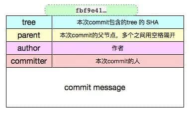


#### Tag 对象

tag 是一个"固化的分支"，一旦打上 tag 之后，这个 tag 代表的内容将永远不可变，因为 tag 只会关联当时版本库中最后一个 commit 对象。

分支的话，随着不断的提交，内容会不断的改变，因为分支指向的最后一个 commit 不断改变。所以一般应用或者软件版本的发布一般用 tag。


git 的 Tag 类型有两种：

##### 1 lightweight (轻量级)

创建方式：

```shell
git tag tagName
```

这种方式创建的 Tag，git 底层不会创建一个真正意义上的 tag 对象，而是直接指向一个 commit 对象，此时如果使用 git cat-file -t tagName 会返回一个 commit。

```shell
→ git cat-file -t v4
commit
→ git cat-file -p v4
tree ceab4f96440655b0ff1a783316c95450fa1fb436
parent 7f23c9ca70ce64fc58e8c7507c990c6c6a201d3d
author 与水  1506224164 +0800
committer 与水  1506224164 +0800

rawtest2
```


##### 2 annotated (含附注)

创建方式：

```shell
git tag -a tagName -m ''
```

这种方式创建的标签，git 底层会创建一个 tag 对象，tag 对象会包含相关的 commit 信息和 tagger 等额外信息，此时如果使用 git cat-file -t tagname 会返回一个 tag。

```shell
→ git cat-file -t v3
tag
→ git cat-file -p v3
object d5d55a49c337d36e16dd4b05bfca3816d8bf6de8   //commit 对象SHA-1
type commit
tag v3
tagger xxx  1506230900 +0800

与水测试标注型tag
```

  

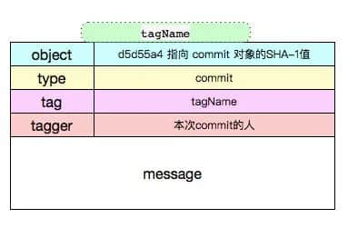

总结：所有对象模型之间的关系大致如下：


### 3. 存储模型

概念

git 区别与其他 vcs 系统的一个最主要原因之一是：git 对文件版本管理和其他 vcs 系统对文件版本的实现理念完成不一样。这也就是 git 版本管理为什么如此强大的最核心的地方。

Svn 等其他的 VCS 对文件版本的理念是以文件为水平维度，记录每个文件在每个版本下的 delta 改变。

Git 对文件版本的管理理念却是以每次提交为一次快照，提交时对所有文件做一次全量快照，然后存储快照引用。

Git 在存储层，如果文件数据没有改变的文件，Git 只是存储指向源文件的一个引用，并不会直接多次存储文件，这一点可以在 pack 文件中看见。


如下图所示：


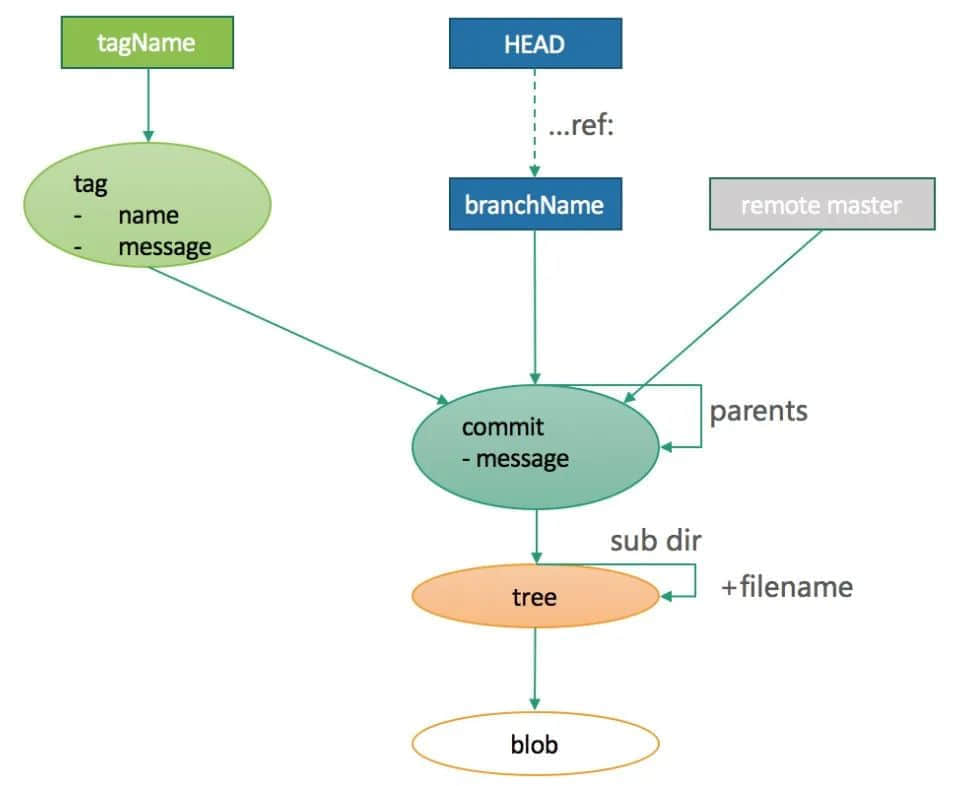


存储

随着需求和功能的不断复杂，git 版本的不断更新，但是主要的存储模型还是大致不变。如下图所示：

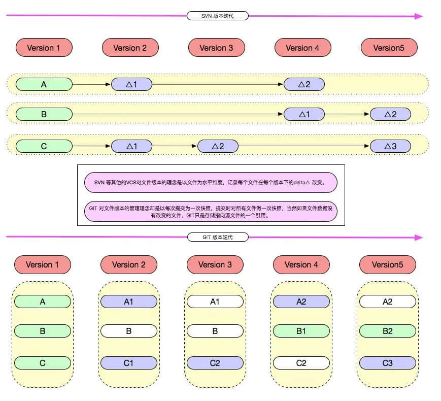


### 4. 检索模型

```
→ cd .git/objects/→ ls03   28   7f   ce   d0   d5   e6   f9   info pack
```


git 的对象有两种：

松散对象，就是在如上 .git/objects 的文件夹 03 28 7f ce d0 d5 e6 f9 等，这些文件夹只有 2 个字符开头，其实就是每个文件 SHA-1 值的前 2 个字母，最多有 #OXFF 256 个文件夹。

打包压缩对象，打包压缩之后的对象主要存在的是 pack 文件中，主要用于文件在网络上传输，减少网络消耗。

**为了节省存储空间，可以手动触发打包压缩操作 (git gc)，将松散对象打包成 pack 文件对象。也可以将 pack 文件解压缩成松散对象 (git unpack-objects)**


```shell
→ cd pack
→ ls
pack-efbf3149604d24e6ea427b025da0c59245b2c2ea.idx  pack-efbf3149604d24e6ea427b025da0c59245b2c2ea.pack
```


为了加快 pack 文件的检索效率，git 基于 pack 文件会生成相应的索引 idx 文件。

#### pack 文件

pack 文件设计非常精密和巧妙，本着降低文件大小，减少文件传输，降低网络开销和安全传输的原则设计的。

pack 文件设计的概图如下：


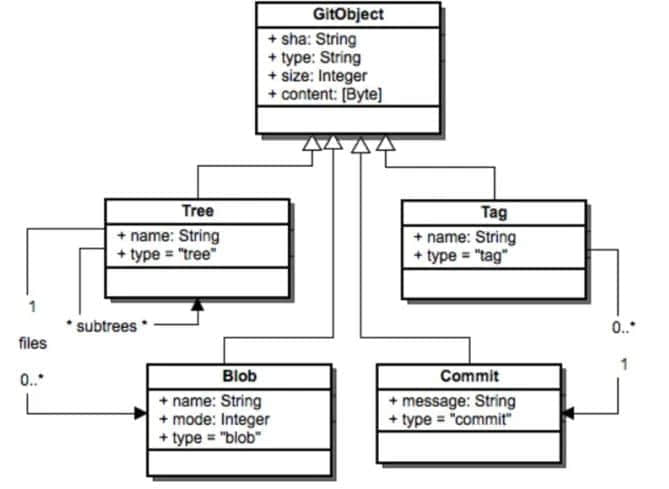


pack 文件主要有三部分组成，Header， Body， Trailer

- Header 部分主要 4-byte "PACK", 4-byte "版本号", 4-byte "Object 条目数"。

- Body 部分主要是一个个 Git 对象依次存储，存储位置在 idx 索引文件中记录改对象在 pack 文件中的偏移量 offset。

- Trailer 部分主要是所有 Objects 的名 (SHA-1）的校验和，为了安全可靠的文件传输。


下面我们看具体的 pack 文件：


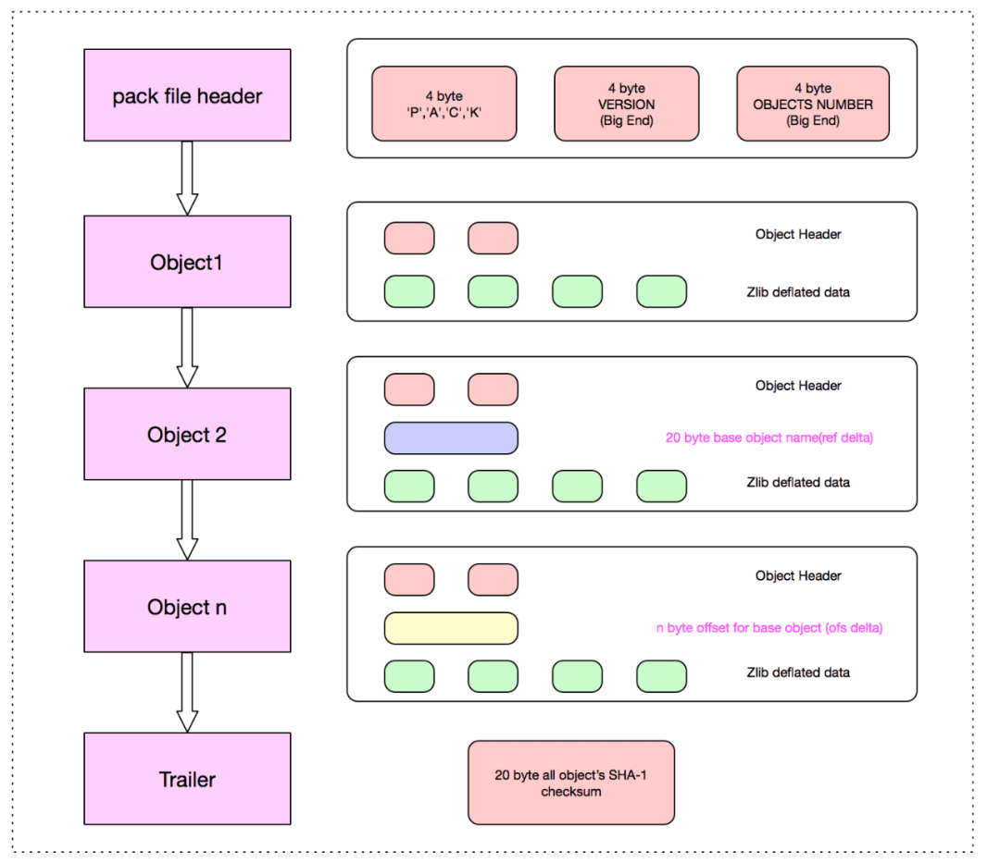


从上图可知：通过 idx 索引文件在 pack 文件中定位到对象之后，对象的结构主要 Header 和 Data 两部分。


##### Header 部分


Header 中首 8-bits：1-bit 是 MSB，接着的 3-bits 表示的是当前对象类型，主要有 6种存储类型，接着的 4-bits 是用于表示该 Object 展开的 (length) 大小的一部分，只是一部分，完整的大小取决于MSB和接下来的多个 bits，完整算法如下：

- 如果 8-bits 中第一位是 1，表示下一个字节还是 header 的一部分，用于表示该对象展开的大小。

- 如果 8-bits 中第一位是 0，表示从下一个字节开始，将是数据 Data 文件。

- 如果对象类型是 OBJ_OFS_DELTA 类型, 表示的是 Delta 存储，当前 git 对象只是存储了增量部分，对于基本的部分将由接下来的可变长度的字节数用于表示 base object 的距离当前对象的偏移量，接下来的可变字节也是用 1-bit MSB 表示下一个字节是否是可变长度的组成部分。对偏移量取负数，就可知 base 对象在当前对象的前面多少字节。
- 如果对象类型是 OBJ_REF_DELTA 类型，表示的是 Delta 存储，当前 git 对象只是存储了增量部分，对于基本的部分，用 20-bytes 存储 Base Object 的 SHA-1 。


##### Data 部分

是经过 Zlib 压缩过的数据。可能是全部数据，也有可能是 Delta 数据，具体看 Header 部分的存储类型，如果是 OBJ_OFS_DELTA 或者 OBJ_REF_DELTA 此处存储的就是增量 (Delta) 数据，此时如果要取得全量数据的话，需要递归的找到最 Base Object，然后 apply delta 数据，在 base object 基础上进行 apply delta 数据也是非常精妙的，此文暂不做介绍。


从上面可以很清晰知道 pack 文件格式，我们再从本地仓库中一探究竟：

不是增量 delta 格式：

```shell
SHA-1 type size size-in-packfile offset-in-packfile
```

增量 delta 格式：

```shell
SHA-1 type size size-in-packfile offset-in-packfile depth base-SHA-1
```


```shell
→ git verify-pack -v pack-efbf3149604d24e6ea427b025da0c59245b2c2ea.pack
cb5a93c4cf9c0ee5b7153a3a35a4fac7a7584804 commit 275 189 12
399334856af4ca4b49c0008a25b6a9f524e40350 commit 69 81 201 1 cb5a93c4cf9c0ee5b7153a3a35a4fac7a7584804
e0efbd5121c31964af1615cf24135a7c6c11cc1d commit 268 187 282
7bc9a5e0199bd4a6d4d223ce7e13239631df9635 commit 29 41 469 1 e0efbd5121c31964af1615cf24135a7c6c11cc1d
2e43c62f6ff99c88d20329487137f8dbabc8b3ec commit 220 157 510
b6f173085f49f109a00b2a3f08a7dc499cc47f1f commit 220 157 667
0466b3f1aadde74234f7dd3f4ef7f1505c50fb0c commit 220 157 824
76c5e45f8e295226b1bc5c8c7e2bc98d7eae6be1 commit 74 85 981 1 b6f173085f49f109a00b2a3f08a7dc499cc47f1f
2729f1fa896d384b49a2f5c53d483eacc0929ebb commit 172 127 1066
3cc58df83752123644fef39faab2393af643b1d2 blob   2 11 1193
62189d1a10cc2a544c4e5b9c4aba9493cf5782dc blob   8 15 1204
a9a5aecf429fd8a0d81fbd5fd37006bfa498d5c1 blob   4 13 1219
2b8982f7c281964658d2cd8b6c17b541533dd277 tree   104 105 1232
92c4aafa39ee387a1f8237f00c78c499aebaf0b2 tree   104 105 1337
223b7836fb19fdf64ba2d3cd6173c6a283141f78 blob   2 11 1442
1756ca64f21724f350fe2cc5cfb218883e314c3d tree   71 80 1453
e11ddfa79f01b01a8e1553bbffaa2d6c03ae9f6e tree   71 80 1533
f70f10e4db19068f79bc43844b49f3eece45c4e8 blob   2 11 1613
e982b6207b10a869164e2c8d19d25ffb059e6a16 tree   66 73 1624
f2e9f73f27124916344e0fd03bb449bc6feca59d tree   66 74 1697
d09da444f461d7cee3679666a1ded5ab79832ed0 tree   33 44 1771
non delta: 18 objects
chain length = 1: 3 objects
pack-efbf3149604d24e6ea427b025da0c59245b2c2ea.pack: ok
```


如 399334856af4ca4b49c0008a25b6a9f524e40350(SHA-1) 表示对象的 base object SHA-1 是 cb5a93c4cf9c0ee5b7153a3a35a4fac7a7584804，base 对象最大深度 (depth) 为 1，如果 cb5a93c4cf9c0ee5b7153a3a35a4fac7a7584804 还有引用对象，则改变 depth 为 2。

pack Header 中最后 4-bytes 用于表示的 pack 文件中 objects 的数量，最多 2 的 32 次方个对象，所以一些大的工程中有多个 pack 文件和多个 idx 文件。

文件的 size (文件解压缩后大小) 有什么用呢，这个是为了方便我们进行解压的时候，设置流的大小，也就是方便知道流有多大。这里 size 不是说明下一个文件的偏移量，偏移量都是来自索引文件，见下面 idx：


#### index 文件


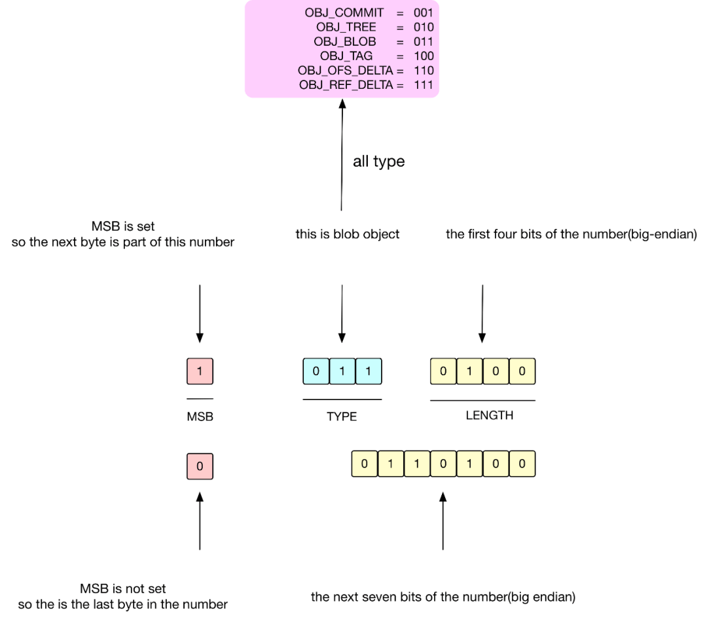


由于 version1 比较简单，下面用 version2 为例子：

分层模式：Header，Fanout,SHA，CRC，Offset，Big File Offset，Trailer。

##### Header 层

version2 的 Header 部分总共有 8-bytes，version 1 的 header 部分是没有的，前 4-bytes 总是 255, 116, 79, 99 因为这个也是版本 1 的开头四个字节，后面 4-bytes 用于表示的是版本号，在当前就是 version 2。

##### Fanout 层

fanout 层是 git 的亮点设计，也叫 Fanout Table（扇表）。fanout 数组中存储的是相关对象的数目，数组下标是对应 16 进制数。fanout 最后一个存储的是整个 pack 文件中所有对象的总数量。Fanout Table 是整个 git 检索的核心，通过它我们可以快速进行查询，用于定位 SHA 层的数组起始 - 终止下标，定位好 SHA 层范围之后，就可以对 SHA 层进行二分查找了，而不用对所有对象进行二分查找。

fanout 总共 256 个，刚好是十六进制的 #0xFF。fanout 数组用 SHA 的前面 2 个字符作为下标(对应 .git/objects 中的松散文件目录名，将 16 进制的目录名转换 10 进制数字)，里面值就是用这两个字符开头的文件数量，而且是逐层累加的，后面的数组数量是包含前面数组的数据的个数的一个累加。


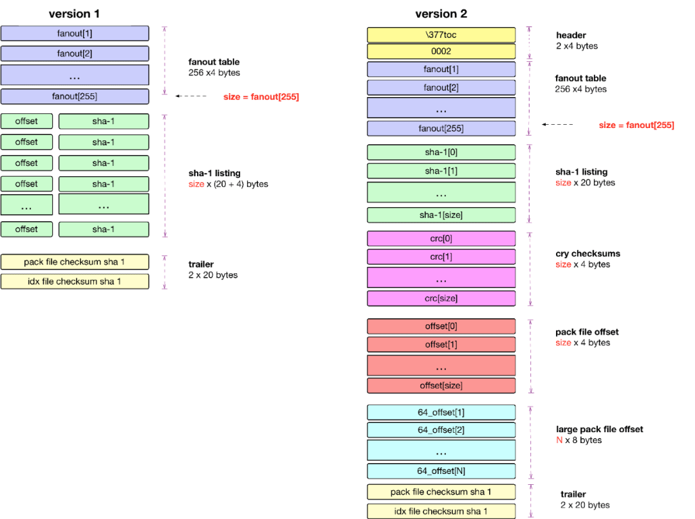


举例如下：

1. 如果数组下标为 0，且 Fanout[0] = 10 代表着 #0x00 开头的 SHA-1 值的总数为 10 个。

2. 如果数组下标为 1，且 Fanout[1] = 15 代表着小于 #0x01 开头的 SHA-1 值的总数为 15 个，从 Fanout[0] = 10 知 Fanout[1] = （15-10）

为什么 git 设计上 Fanout[n] 会累加 Fanout[n-1] 的数量？这个主要是为了快速确定 SHA 层检索的初始位置，而不用每次去把前面所有 fanout[..n-1] 数量进行累加。

##### SHA 层

是所有对象的 SHA-1 的排序，按照名称排序，按照名称进行排序是为了用二分搜索进行查找。每个 SHA-1 值占 20-bytes。

##### CRC 层

由于文件打包主要解决网络传输问题，网络传输的时候必须通过 crc 进行校验，避免传输过程中的文件损坏。CRC 数组对应的是每个对象的 CRC 校验和。

##### Offset 层

是由 4 byte 字节所组成，表示的是每个 SHA-1 文件的偏移量，但是如果文件大于 2G 之后，4 byte 字节将无法表示，此时将：

4 byte 中的第一 bit 就是 MSB，如果是 1 表示的是文件的偏移量是放在第 6 层去存储，此时剩下的 31-bits 将表示文件在 Big File Offset 中的偏移量，也就是图中的，通过 Big File Offset 层 就可以知道对象在 pack 中的 offset。

4 byte 中的第一 bit 就是 MSB，如果是 0 31-bits 表示的存储对象在 packfile 中的文件偏移量，此时不涉及 Big File Offset 层

##### Big File Offset 层

用于存储大于 2G 的文件的偏移量。如果文件大于 2G，可以通过 offset 层最后 31 bits 决定在 big file offset 中的位置，big file offset 通过 8 bytes 来表示对象在 pack 文件中的位置，理论上可以表示 2 的 64 次方文件大小。

##### Trailer 层

包含的是 packfile checksum 和关联的 idx 的 checksum。

##### 索引流程

从上面的分层知道 git 设计的巧妙。git 索引文件偏移量的查询流程如下：


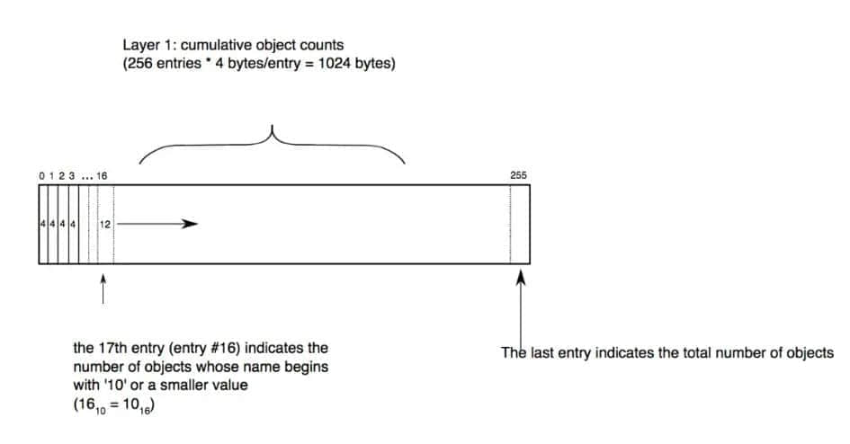


#### 查询算法

通过 idx 文件查询 SHA-1 对应的偏移量：


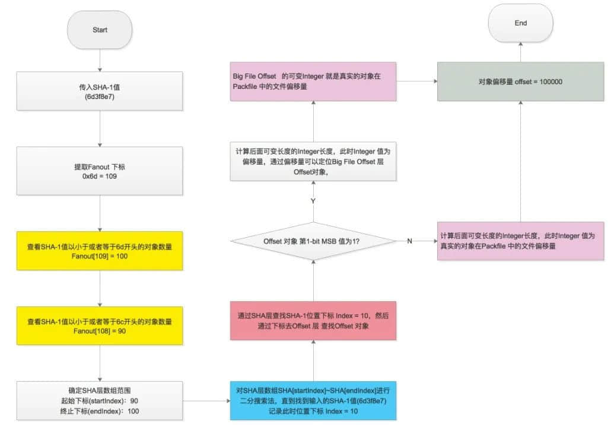


在 pack 文件中通过偏移量找到对象：


如果是普通的存储类型。定位到的对象就是用 Zlib 压缩之后的对象，直接解压缩即可。

如果是 Delta 类型需要 递归查出 Delta 的 Base 对象，然后再把 delta data 应用到 base object 上(可参考 git-apply-delta)。


### 参考资料

git 大多资料主要介绍是 git 使用，很少系统去讲解底层数据结构和原理。本文通过多个开源代码入手，结合 git 文档，参考相关 git 开发者或相关研究文章，git 邮件列表等。下面是我探究觉得比较可靠的资料文档集。

#### 参考文档

> https://stackoverflow.com/questions/8198105/how-does-git-store-files
>
> https://www.npmjs.com/package/git-apply-delta
>
> https://git-scm.com/book/en/v2/Git-Internals-Packfiles
>
> https://codewords.recurse.com/issues/three/unpacking-git-packfiles
>
> http://shafiulazam.com/gitbook/7_the_packfile.html
>
> http://wiki.jikexueyuan.com/project/git-community-book/packfile.html
>
> http://documentup.com/skwp/git-workflows-book
>
> http://www.runoob.com/git/git-workspace-index-repo.html
>
> http://shafiulazam.com/gitbook/1_the_git_object_model.html
>
> http://eagain.net/articles/git-for-computer-scientists/
>
> https://www.kernel.org/pub/software/scm/git/docs/user-manual.html#object-details
>
> https://stackoverflow.com/documentation/git/topics
>
> https://stackoverflow.com/search?page=2&tab=Votes&q=user%3a1256452%20%5bgit%5d
>
> http://git.oschina.net/progit/9-Git-%E5%86%85%E9%83%A8%E5%8E%9F%E7%90%86.html#9.5-The-Refspec
>
> https://codewords.recurse.com/issues/three/unpacking-git-packfiles
>
> http://shafiulazam.com/gitbook/7_the_packfile.html
>
> https://w.org/pub/software/scm/git/docs/user-manual.html#object-details


#### git 源码

sha1_file.c sha1_object_info_extended 读取对象

sha1_file.c find_pack_entry_one 从索引中寻找

#### 其他 git 源码

go-git https://github.com/src-d/go-git

gitgo https://github.com/ChimeraCoder/gitgo
