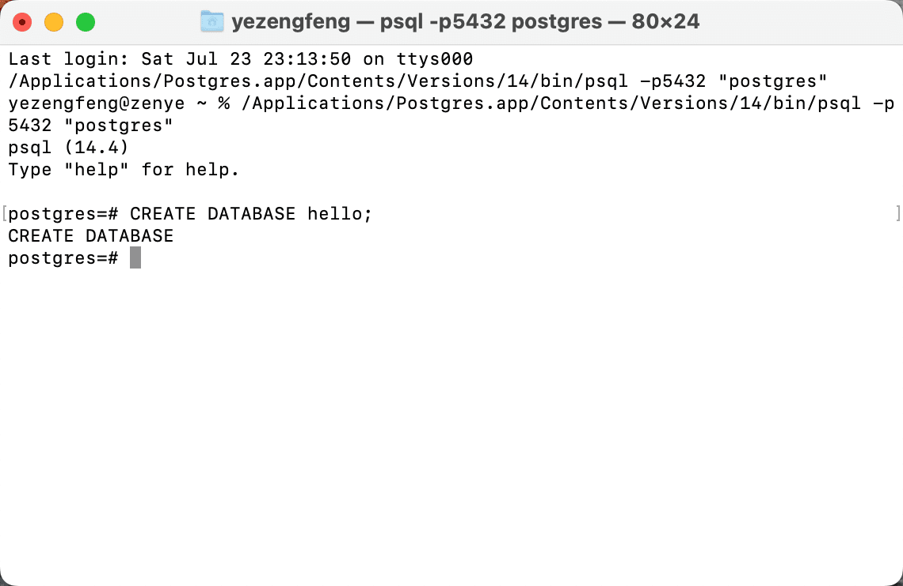
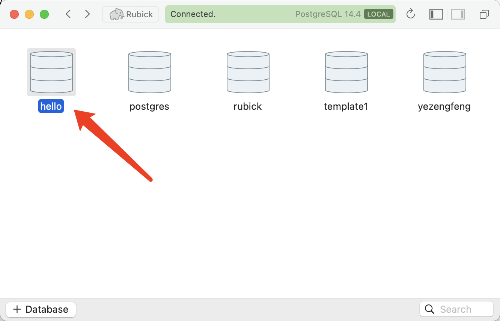

Additions to the  [Vapor Doc - Fluent](https://docs.vapor.codes/fluent/overview/) 

<!--more-->

### 1. Create database by yourself first

#### 1.1 Download [PostgreSQL app](https://postgresapp.com/)

#### 1.2 Create Database




#### 1.3 Use database in Vapor

```swift
app.databases.use(
  .postgres(
    hostname: "localhost",
    username: "postgres",
    password: "",
    database: "hello"),
  as: .psql)
```

#### 1.4 Migrate

```bash
$ vapor run migrate

# revert migration
$ vapor run migrate --revert
```

#### 1.5 Check your database with [Postico app](https://eggerapps.at/postico/)




### 2. Model - [Custom identifier](https://docs.vapor.codes/fluent/model/#custom-identifier)

#### 2.1 model

```swift
final class User: Model {
  static let schema = "user"

  @ID(custom: "name")
  var id: String?
  
  @Field(key: "age")
  var age: Int
  
  init() {}

  init(id: String? = nil, age: Int) {
    self.id = id
    self.age = age
  }
}
```

#### 2.2 migration

```swift
struct CreateUser: AsyncMigration {
  // Prepares the database.
  func prepare(on database: Database) async throws {
    try await database.schema(User.schema)
      .field("name", .string, .identifier(auto: false))
      .field("age", .int)
      .create()
  }

  // Optionally reverts the changes made in the prepare method.
  func revert(on database: Database) async throws {
    try await database.schema(User.schema).delete()
  }
}
```

#### 2.3 configure

```swift
app.migrations.add(CreateUser())
try app.autoMigrate().wait()

try await User(id: "Bob", age: 18).save(on: app.db)

let user = try await User.find("Bob", on: app.db)
```

